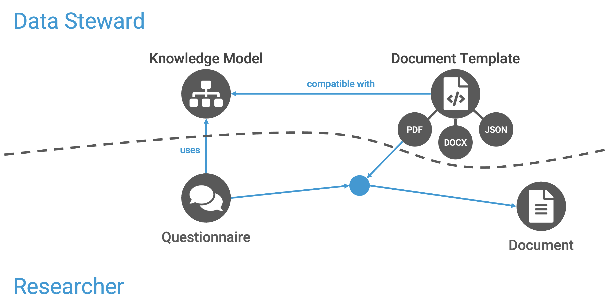

.. _overview:

Overview
********

Different components in the |project_name_full| are connected to create a data management plan and help with data management in general. Different components are typically made and used by different user roles. Data stewards work on preparing content (such as **knowledge models** or **document templates**) for researchers that they can use to work on their data management plans while filling in the **questionnaires** and exporting **documents**.

Data Management Planner
=======================

Data Management Planner is the core of the FAIR Wizard. It enables creation of Data Management Plans (DMPs) and other documents based on the answers to a questionnaire. The DMPs are created using a knowledge model and a document template. The knowledge model defines the structure of the questionnaire, and the document template defines the structure of the resulting document.

   Different components of the |project_name_full| and roles interacting with them.

Knowledge Model
---------------

The knowledge model refers to something like a template for the questionnaire. However, it is not linear but has a tree-like structure with different branches based on the previous answer. Therefore, even if it can be complex overall, only the specific questions are used in the questionnaire.

:ref:`Learn more about knowledge models →<knowledge-model>`

Document Template
-----------------

While the knowledge model defines the structure of the questionnaire, it does not specify how the resulting document (such as the DMP) will look. We use document templates for that. They transform the answers into documents such as PDF, MS Word, or machine-actionable RDF. This way, we can only answer once and produce different documents.

:ref:`Learn more about document templates →<document-template>`

Questionnaire
-------------

A questionnaire is part of a :ref:`project<project>` where researchers fill in their answers regarding their particular research. It uses a specific knowledge model that defines its structure.

:ref:`Learn more about questionnaires →<questionnaire>`

Document
--------

Documents are produced from the questionnaire answers and a document template. The document template understands the knowledge model structure and knows how to transform the questionnaire answers into a specific document in the selected format. The documents are saved within a project where they were created from the questionnaire.

:ref:`Learn more about documents →<documents>`

Admin Center
============

The Admin Center is an application in which can administrators manage the FAIR Wizard application. This includes management of users, their roles and user groups and various imports. It also includes the management of the application itself. 

Users
-----

Users are people who use the FAIR Wizard. They can be researchers, data stewards, or administrators. Each user has a role that defines what they can do in the application. Users can be organized into user groups.

:ref:`Learn more about users →<user-list>`

Imports
-------

Imports are used to import data into the FAIR Wizard. This can be used to import users and projects.

:ref:`Learn more about imports →<import>`

Audit Log
---------

Audit Log is a log of all the actions that have been done in the FAIR Wizard. It is used to track changes and actions done by users.

:ref:`Learn more about audit log →<audit-log>`

Integration Hub
===============

The Integration Hub is an application that is used to create integrations. At the moment it allows creation of Value Integrations.

Value Itegrations
-----------------

Value Integrations are used to create integrations from data stored in CSV format. These integrations can then be used in Knowledge Models.

:ref:`Learn more about value integrations →<value-integrations>`

Reporting
=========

Reporting is an application that is used to generate reports. Reports can be done on Projects and Users.
