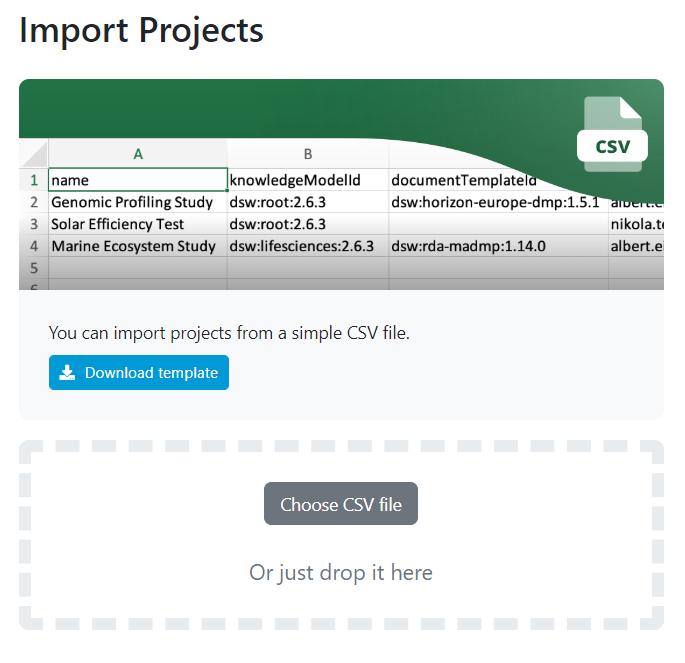

.. _projects-import:

Projects Import
***************

As an administrator, we can import projects using provided template. The template has four columns: name, knowledgeModelId, documentTemplateId and emails of users we want to add as owners to a project. Once it is filled with data, we can import it back to the FAIR Wizard to populate it with projects.

.. TODO::

    Replace screenshot

    
    Import projects.
