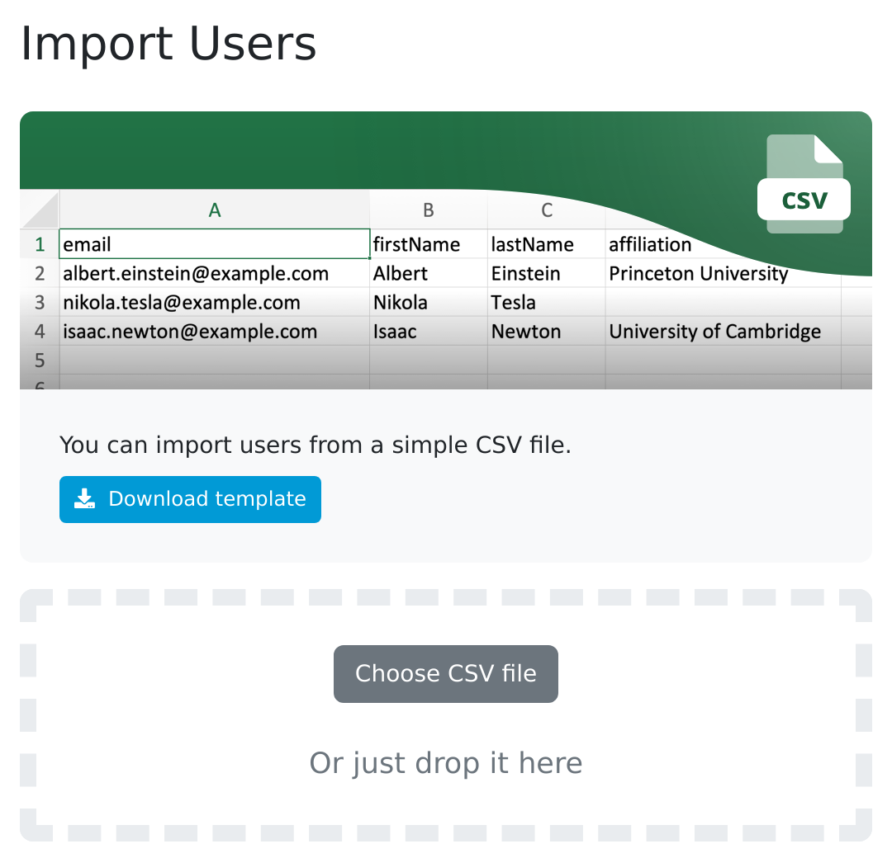

.. _user-import:

Users Import
************

As an administrator we can import users using provided template. The template has four columns: email, firstName, lastName and affiliation. Once it is filled with data, we can import it back to the FAIR Wizard to populate it with users.

.. TODO::

    Replace screenshot

    
    Import users.
