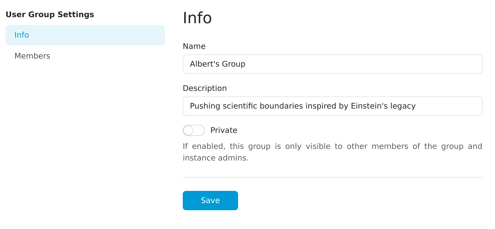
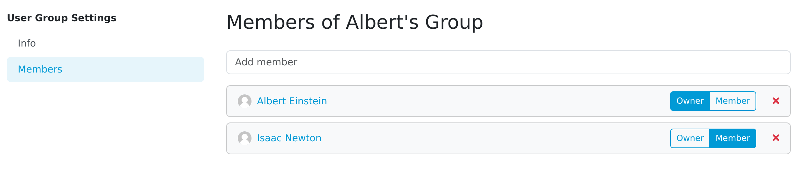

.. _detail:

User Group Detail
*****************

As an administrator, we can manage existing user group from User Group Settings. We can change name and description of a group and make it private. If a group is private, then only its members and instance admins can see it.

    
    User group detail.

We can also see list of all members of a group. Each member can be set as either Owner of a group or its member. Member can also be removed from the group by clicking on the x button. We can view users’ profile by clicking his name.

    
    User group members.

We can add new members to the group by picking them from dropdown menu.

.. NOTE::

    Don't forget to click on the Save button to save the changes.
