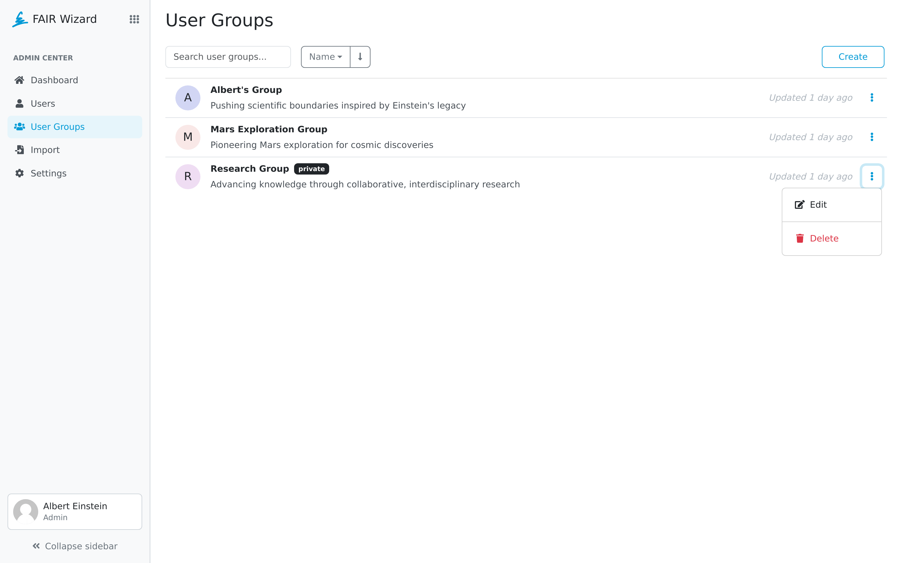

.. _user-groups:

User Groups
***********

As an administrator, we can create a user group. The group can be used to add multiple people to a project at once. A group can be selected in :ref:`sharing settings<sharing>` of a project.

User Groups list allows administrators to see and manage all user groups in a |project_name| instance. The list can be searched based using name fragment, and sorted via properties of user groups, name and date created.

User Group Settings can be opened by clicking the name of a user group or by selecting :guilabel:`Edit` in the right dropdown menu for the desired row. There, a user group can be also deleted via the :guilabel:`Delete` action. Finally, a new user group can be created by clicking :guilabel:`Create`.

    
    User groups.

----

.. raw:: html
    
    <h2>Table of Contents</h2>

.. toctree::
    :maxdepth: 2

    Create<create>
    Detail<detail>
