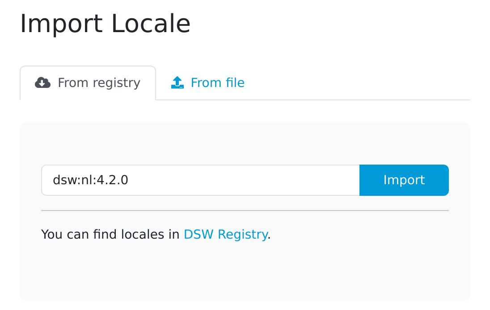
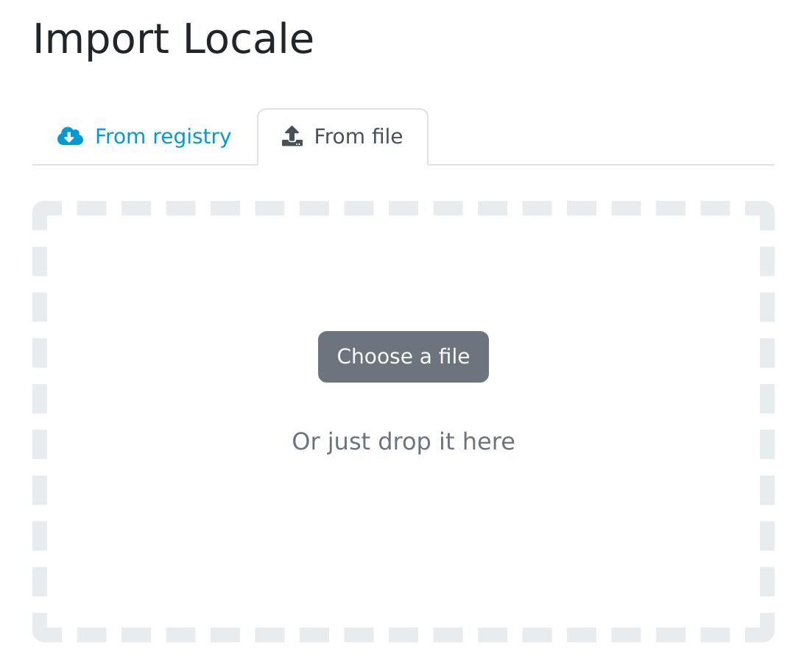

.. _locale-import:

Import Locale
*************

We can import an existing locale by navigating to :menuselection:`Settings → Locales` in the main menu and then clicking on :guilabel:`Import` button on the list of locales.

.. _locale-import-from-registry:

From FAIR Wizard Registry
=========================

The |project_name| instance is connected to the `FAIR Wizard Registry <https://registry.fair-wizard.com/>`__. That allows us to import locales from it by entering the **locale ID** of desired template (e.g. ``dsw:cs:4.3.0``) and pressing the :guilabel:`Import` button.

.. NOTE::

    In case of locales present in the `FAIR Wizard Registry <https://registry.fair-wizard.com/>`__, we will be notified about the available upgrades.

    
    Input for importing a locale from FAIR Wizard Registry.

From file
=========

We can import a locale as a ZIP package. Such a package can be created as an export from |project_name|.

    
    Input for importing a locale using a ZIP package.

