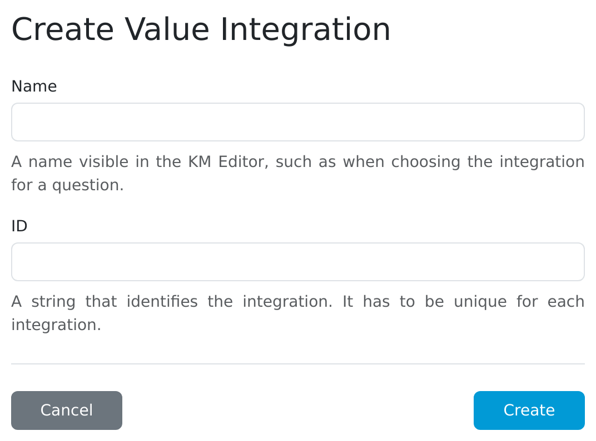

.. _value-integrations-create:

Create
******

As an administrator, we can create a value integration. To start, we must fill in its name and id. After clicking on :guilabel:`Create` button, we can continue in the :ref:`value integration detail<detail>`.

.. TODO::

    Replace screenshot.

    
    Create value integration.
