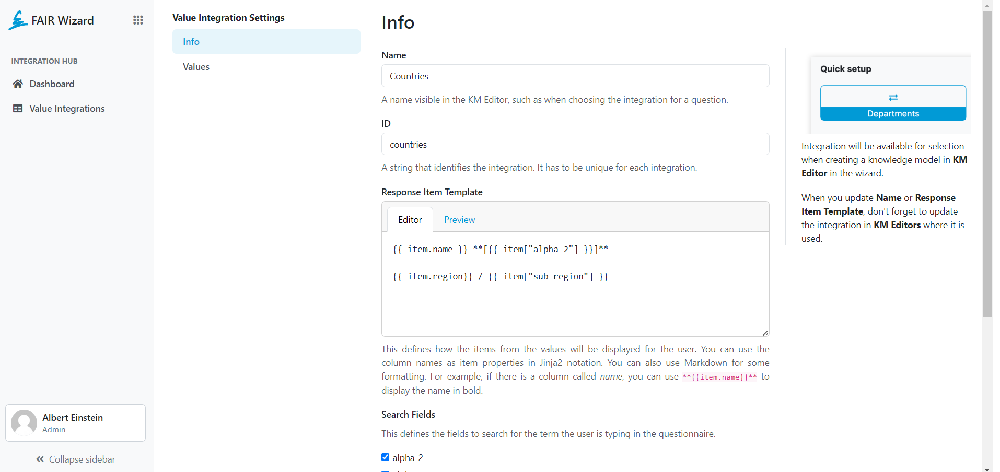
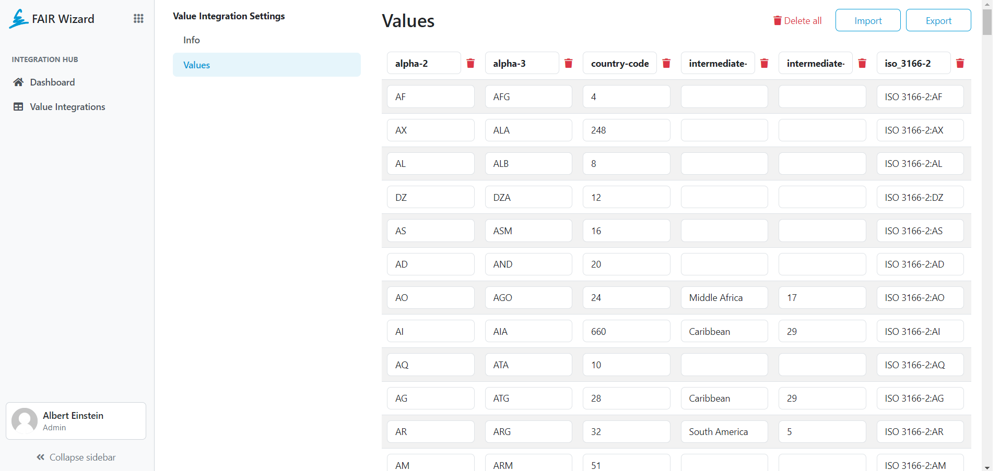
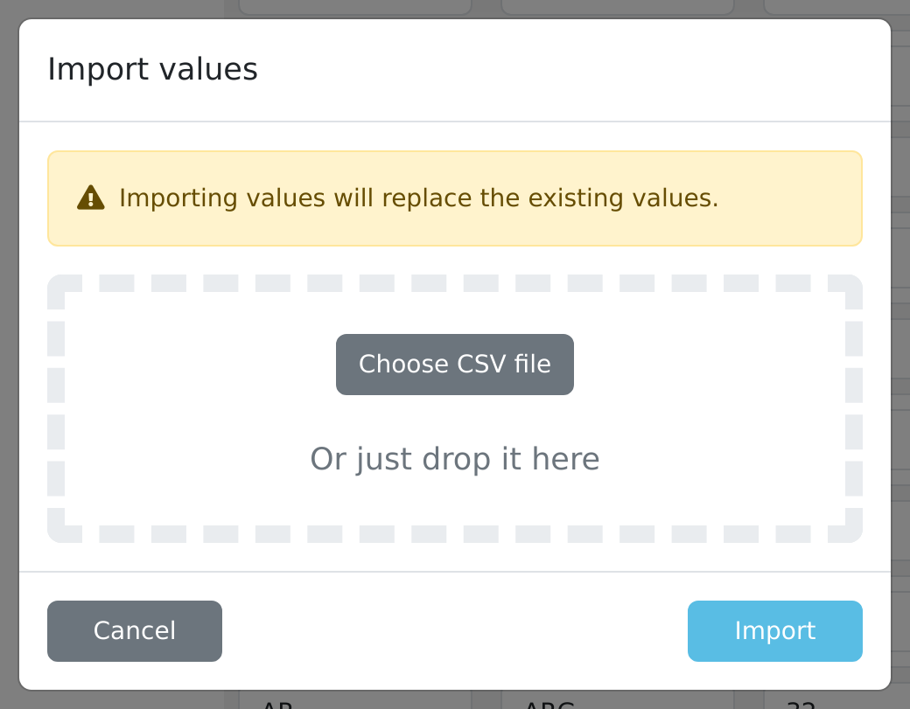

.. _value-integrations-detail:

Detail
******

As an administrator, we need to fill in some information about the Integration. We have filled ``name`` and ``ID`` in the previous step, now we just need to fill in the ``Response Item Template``. This defines how the items from the values will be displayed for the user. You can use the column names as item properties in ``Jinja2`` notation. You can also use ``Markdown`` for some formatting. For example, if there is a column called name, you can use ``**{{item.name}}**`` to display the name in bold.

.. TODO::

    Replace screenshot

    Value integration detail info.

In Values, we can set up specific values. First, we need to give names to columns and then fill the rows with data. We can do that either manually or use Import functionality. We can also manually delete columns or rows or :guilabel:`Delete all`.

.. TODO::

    Replace screenshot

    Value integration detail valuess.

.. NOTE::

    Order of columns can be random as it does not matter for the JSON.

.. WARNING::

    JSON is case sensitive. 

We can import any CSV file. To do that, we click on the :guilabel:`Import` button and select the file. The file should be in CSV format and the first row should contain the column names. The file should not contain any empty rows. If the file is not in the correct format, the system will display an error message.

.. TODO::

    Replace screenshot

    Value integration import.

If we choose to insert values manually or do some changes to the values, we can always use :guilabel:`Export` button to get the data.

.. NOTE::

    Don’t forget to save your changes.
