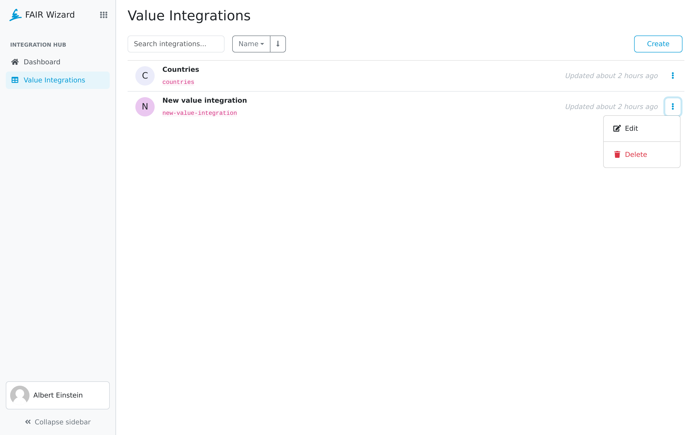

.. _value-integrations:

Value Integrations
******************

As an administrator, we can use value integration to setup an integration to be used by Data Stewards in their Knowledge Models as source of data.

We can start creating a new value integration by clicking on the :guilabel:`Create` button.

.. TODO::

    Replace screenshot

    
    Value integrations.

----

.. raw:: html
    
    <h2>Table of Contents</h2>

.. toctree::
    :maxdepth: 2

    Create<create>
    Detail<detail>
