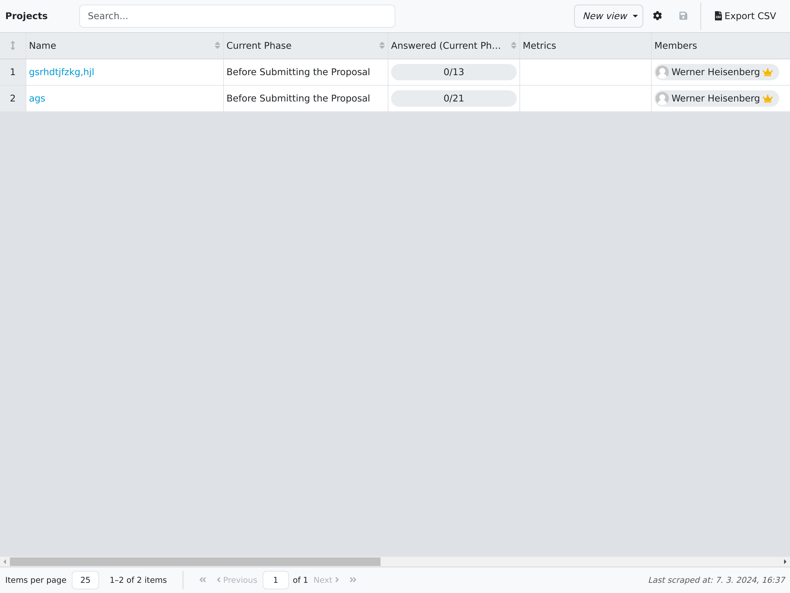
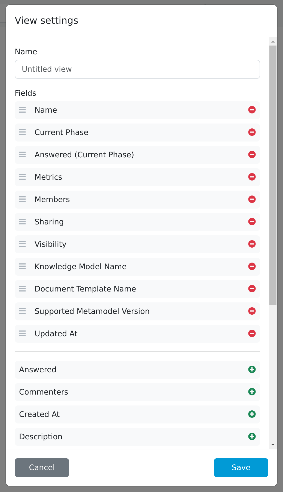

.. _reporting-projects:

Projects
********

As an administrator, we can create a report based on various projects. We can select from many different fields and see how our projects are doing in them. The report can be modified and save to be viewed later. The data of the report can also be exported to a CSV file.

.. TODO::

    replace image with new one

    
    Projects overview.

New report can be created by clicking on the dropdown menu in the top right corner. Then by clicking on :guilabel:`+ Create a new view` we open the view settings. We can give our view a name and select which fields we want to have in there. The report can be saved by clicking on :guilabel:`Save`. We can also delete the report by clicking on :guilabel:`Delete`.

.. TODO::

    replace image with new one

    
    Form for editing reporting view.

    
We can resize all rows height by clicking on the double arrow in the top left corner. If we want to edit width or height of individual cells, we can do it using drag-and-drop on the borders. Lastly we can edit how many rows are on the page by clicking on the :guilabel:`Items per page` dropdown menu.

.. NOTE::

    Don't forget to click on :guilabel:`Save` icon after you are done with editing the view.

The report can be exported to a CSV file by clicking on :guilabel:`Export CSV`.
