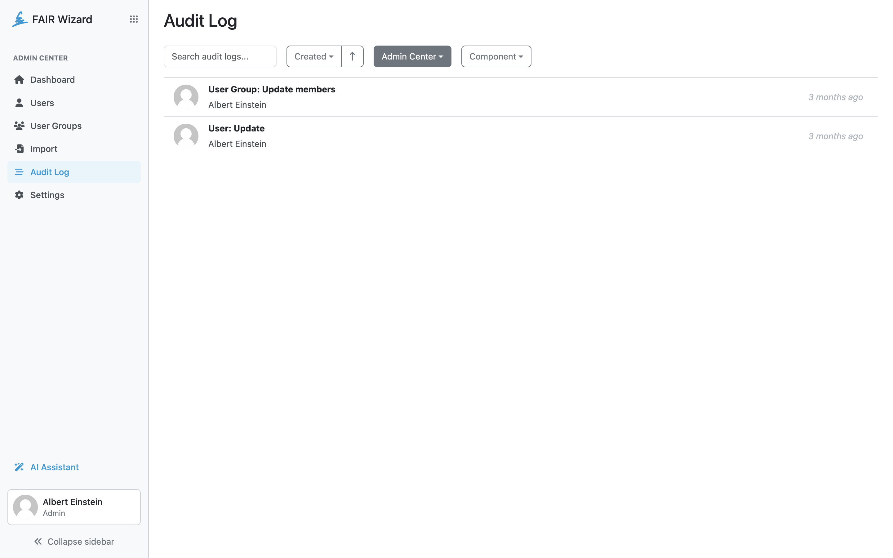
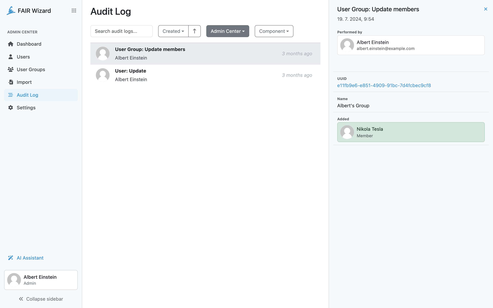

.. _audit-log:

Audit Log
*********

Audit log is a feature that allows administrators to track everything that is happening in the FAIR Wizard.

.. NOTE::

    For now, Audit log is available for Admin Center, Analytics and Integration Hub. Data Management Planner will be added in the future updates.

List can be searched based using content of audit logs. The dropdown menu can be used to select which app logs we want to display. Then we can also select which component we want to see. In the list we can see what particular action has been done, who did it and when it happened.

    
    Audit log.

A log item detail can be opened by clicking any log record. Based on which log record has been opened, detail contains information on what was changed and how. Some things, such as performer of the change can be clicked to open a detail of that user.

    
    Audit log detail.
