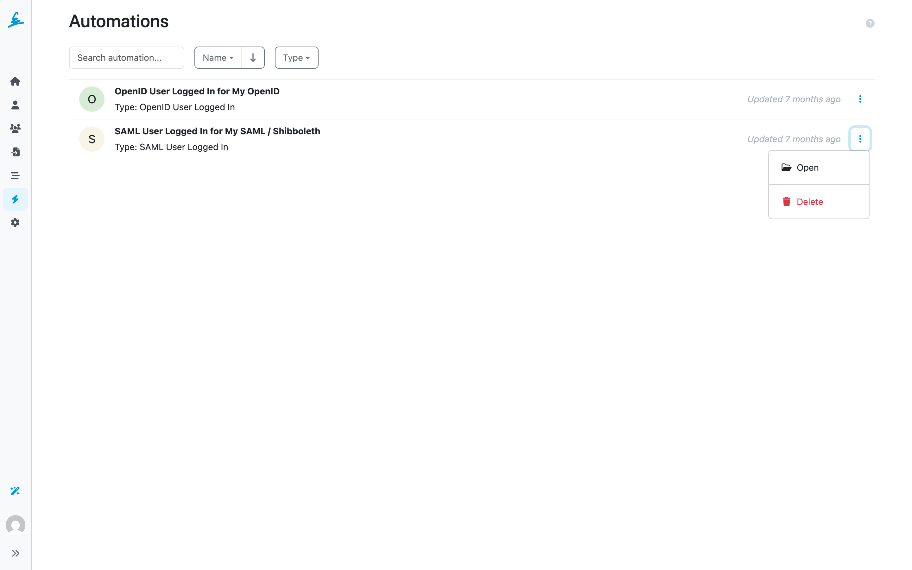
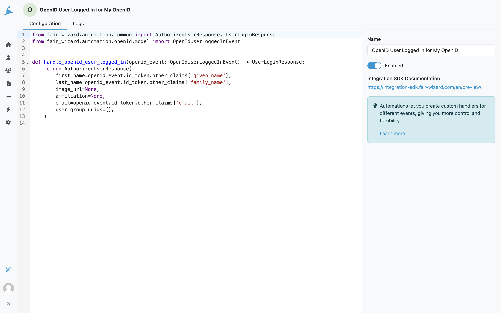
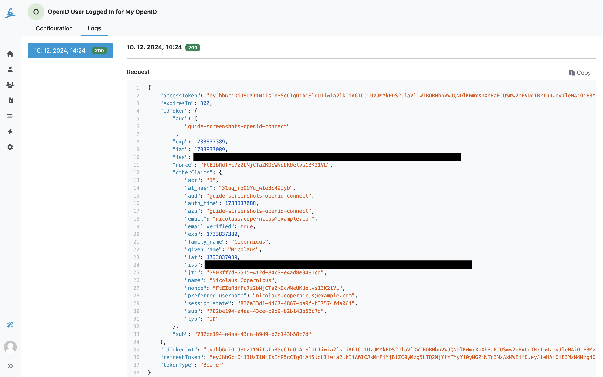
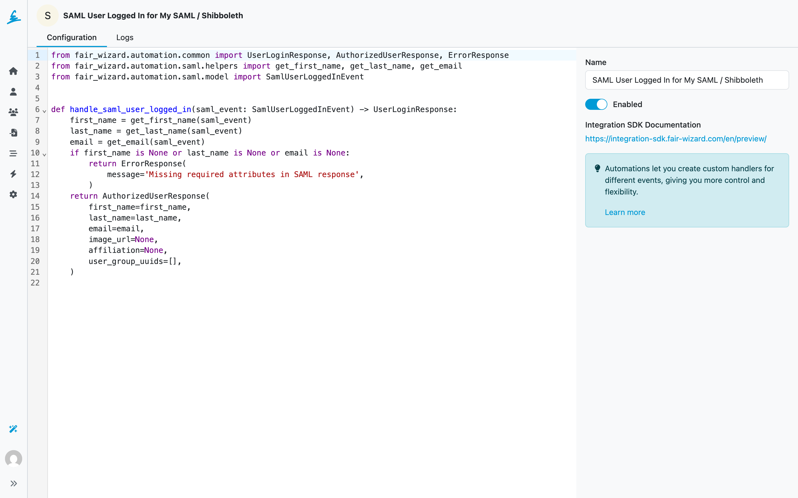
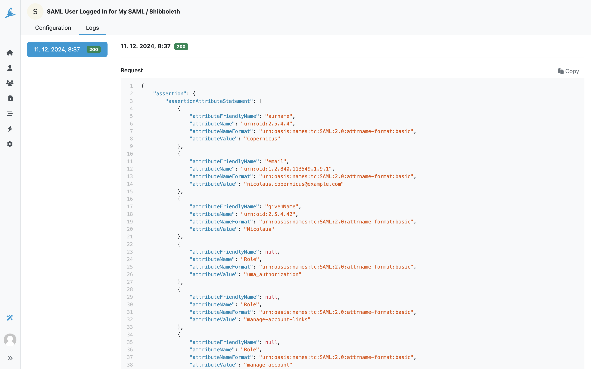

.. _automations:

Automations
***********

.. WARNING::

    Only the automation for SSO login is available at the moment. More automations will be added in the future.

Automations are customizable pieces of code that adjust the behavior of FAIR Wizard when certain events occur. Currently, automations support events when user logs in via Single Sing On (OpenID or SAML).

Users need the :ref:`Manage Automations<roles>` role permission to create and configure Automations. This permission also requires :ref:`Manage Settings<roles>`.

    List of Automations with possible actions.

The Automations use the Integration SDK to create and manage automations. The SDK provides a set of classes and methods that allow you to create and manage automations. The SDK is available in the FAIR Wizard application and can be accessed by going to the Open ID or SAML Settings. The SDK has its own `documentation <https://integration-sdk.fair-wizard.com/en/latest/>`__.

From Automations list we can open specific automations or delete them. To create a new automation, go either to :doc:`../settings/authentication/openid` or :doc:`../settings/authentication/saml`.

    Example of Open ID Automation configuration.

Example of OpenID Automation to check if an user should be able to login:

.. code:: python

    from fair_wizard.automation.openid.model import OpenIdUserLoggedInEvent, UserLoginResponse, ErrorResponse, AuthorizedUserResponse, ForbiddenResponse

    DATA_OFFICERS_GROUP_UUID = '1431c94b-87ef-4c99-bef1-b75974ca63fc'

    def handle_openid_user_logged_in(openid_event: OpenIdUserLoggedInEvent) -> UserLoginResponse:
        try:
            user_type = check_user_type(openid_event)
        except Exception:
            return ErrorResponse(
                message='Failed to check user type',
            )
        groups = []
        if user_type == 'student':
            return ForbiddenResponse(
                message='Students are not allowed to log in',
            )
        elif user_type == 'data_officer':
        groups.append(DATA_OFFICERS_GROUP_UUID)
        return AuthorizedUserResponse(
            first_name=openid_event.id_token.other_claims['given_name'],
            last_name=openid_event.id_token.other_claims['family_name'],
            image_url=None,
            affiliation=None,
            email=email,
            user_group_uuids=groups,
        )

    Each run of an Automation is logged.

Similarly we can set up an Automation for SAML login.

    Example of SAML Automation configuration.

    Each run of an Automation is logged.
