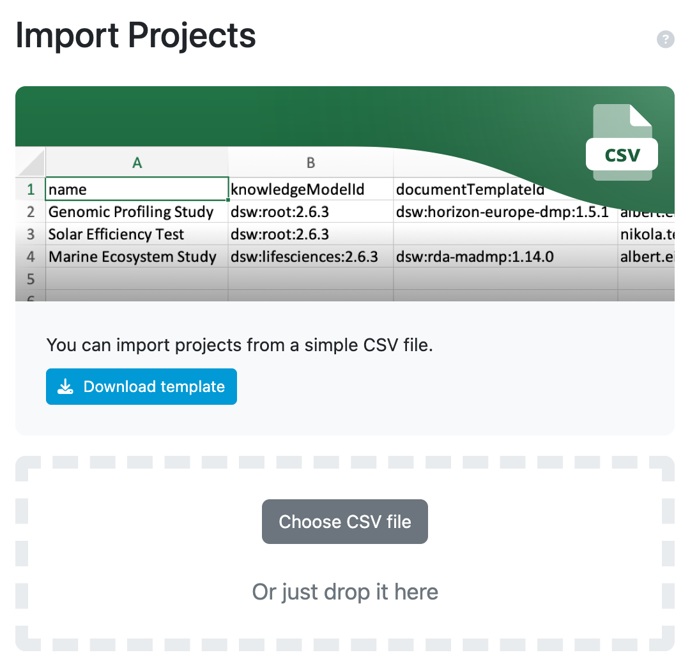

.. _projects-import:

Projects Import
***************

Users with the :ref:`Manage ALL Projects<roles>` role permission can import projects using provided template. The template has four columns: name, knowledgeModelUuId, documentTemplateUuId and emails of users we want to add as owners to a project. Once it is filled with data, we can import it back to the FAIR Wizard to populate it with projects.

.. NOTE::

    We can find the knowledgeModelUuId for each knowledge model in the :ref:`Knowledge Models<km-detail>` section of the FAIR Wizard. Open Knowledge Model detail and copy the UUID from the URL. For example, if the URL is `https://fair-wizard.com/knowledge-models/123e4567-e89b-12d3-a456-426614174000`, then the knowledgeModelUuId is `123e4567-e89b-12d3-a456-426614174000`.

    We can find the documentTemplateUuId for each document template in the :ref:`Document Templates<dt-detail>` section of the FAIR Wizard. Open Document Template detail and copy the UUID from the URL. For example, if the URL is `https://fair-wizard.com/document-templates/123e4567-e89b-12d3-a456-426614174000`, then the documentTemplateUuId is `123e4567-e89b-12d3-a456-426614174000`.

    Import projects.

.. WARNING::

    Using Microsoft Excel to edit the template may cause issues with the encoding of the file. If you encounter any issues, please use some other editor to edit the file.
