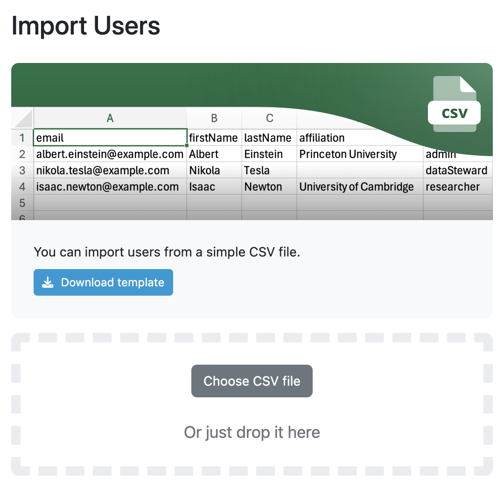
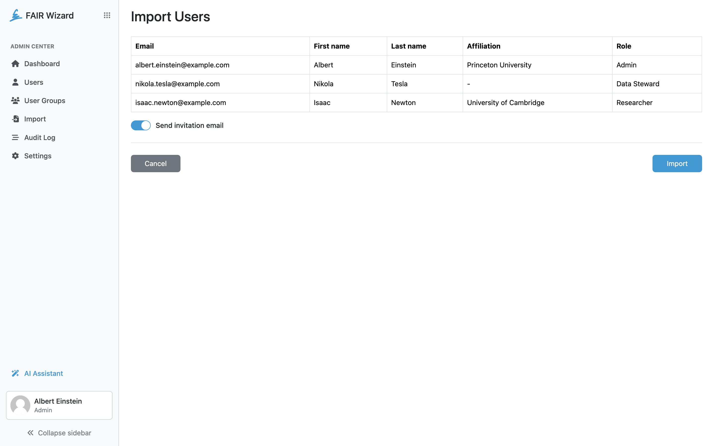

.. _import-users:

Users Import
************

As an administrator we can import users using provided template. The template has five columns: email, firstName, lastName, affiliation and role. Once it is filled with data, we can import it back to the FAIR Wizard to populate it with users.

    
    Import users.

We can also select if we want to send an invitation email or not by :guilabel:`Send invitation email` switch.

    
    Import users confirmation with switch to send invitation email.
