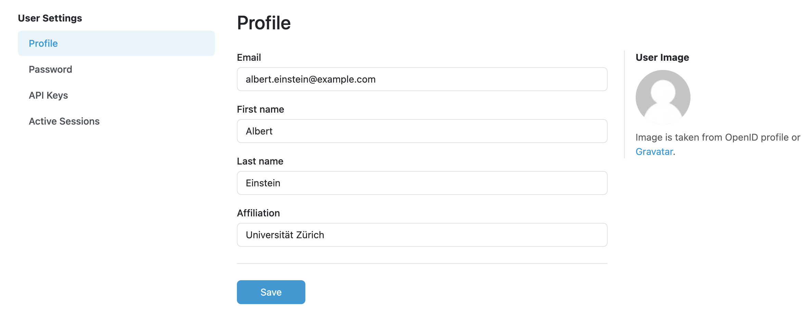

.. _edit-profile-admin:

Edit Profile
************

After navigating to :guilabel:`Edit profile` from the :doc:`../index` menu, we open the User Settings. We can edit our **Email** address, **First name**, **Last name**, and **Affiliation**. We need to submit the changes by clicking :guilabel:`Save` button.

    
    Form for editting profile.

If we want to :doc:`./password`, we need to switch to :guilabel:`Password` from the left menu titled **User settings**.

----

.. raw:: html
    
    <h2>Table of Contents</h2>

.. toctree::
    :maxdepth: 2

    Change Password<password>
    API Keys<api-keys>
    Active Sessions<active-sessions>
    