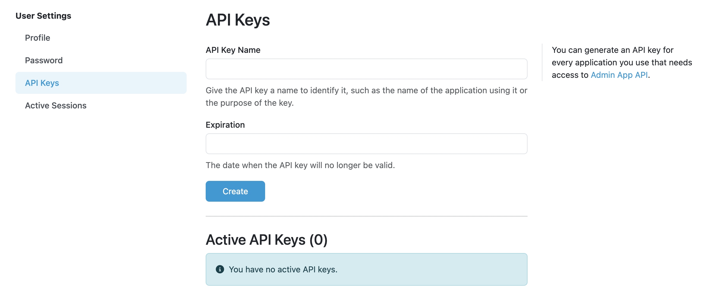

.. _api-keys-admin:

API Keys
********

When we want to access the FAIR Wizard through FAIR Wizard API we have to set up an API Key. The API Key has an :guilabel:`API Key Name` so we can remember for what purpose this Key is used and :guilabel:`Expiration` which is a date from when the API Key will no longer be valid.

    Form for creating an API Key.

After filling out the :guilabel:`API Key Name` and :guilabel:`Expiration`, an **API Key** is generated. In this step we have to copy the API Key, because after seeing it once, it is no longer possible to access it again.

After we click on Done button, the new API Key is hidden and the information about this key is added to the table below, that contains all Active API Keys.

.. NOTE::

    There is only one common API Key for Admin Center, Integration Hub and Analytics. It needs to be set up in this section and then it is used for all three apps. Data Management Planner has its own :ref:`api-keys` that can be set up there.

