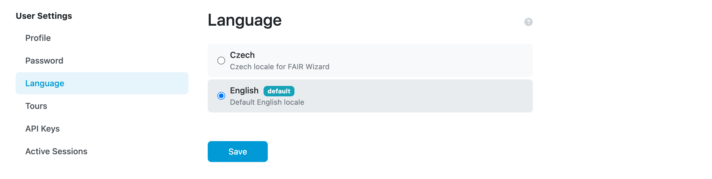

Language
********

A user can explicitly select a desired language after clicking :guilabel:`Change language` from the :doc:`./index` menu. In case the language becomes unavailable later after the selection, FAIR Wizard will use language marked as **default**.

The preferred language is determined in the following order: the user's profile settings, then browser settings, and finally the default system language if the previous options are not set.

    Language selection in the user settings.

