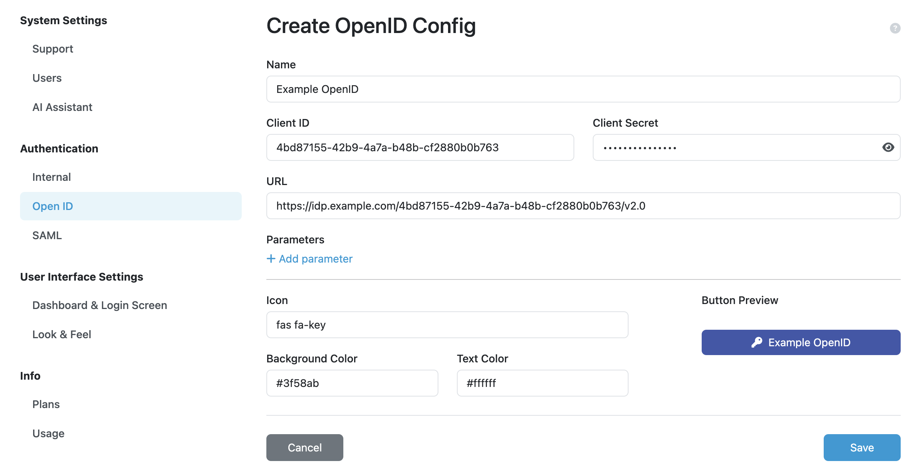

OpenID Settings
****************

Using these settings we can add `OpenID <https://openid.net/>`__ configuration to allow logging into the FAIR Wizard via external identity provider.

FAIR Wizard supports Microsoft Azure as well as any other OpenID providers. Following are detailed description of the setups for both of these options.

.. NOTE::

    After setting a new OpenID service, we should directly test it and verify that the configuration works well. For that, we can simply open our FAIR Wizard in a new anonymous window of the web browser.

Microsoft Azure Setup
=====================

1. Go to https://portal.azure.com/.
2. Go to ``App registrations``.
3. Click on ``New registration``.
4. Fill in a name.
5. Select ``Accounts in this organizational directory only (Single tenant)``.
6. Keep ``Redirect URI`` empty.
7. Click on ``Register``.
8. Copy and store ``Directory (tenant) ID`` and ``Application (client) ID``.
9. Click on ``Manage`` in the left menu → ``Certificates & Secrets``.
10. Click on ``New client secret``.
11. Fill description, set ``Expires`` and note it somewhere, then click on ``Add``.
12. Copy ``Value`` and store it somewhere. You will not able to view it again.

13. Go to OpenID in FAIR Wizard: ``Admin Center`` → ``Settings`` → ``Organization OpenID`` → ``Create``.

14. Fill in a ``Name`` of the service. This name will be used to identify the service in the list of login options, so it should be something descriptive.

15. Open the ``Microsoft`` tab and fill in :
	- ``Application (client) ID``
	- ``Directory (tenant) ID``
	- ``Client Secret`` → ``<stored secret value>``

16. (optional) fill Icon (``fab fa-microsoft``, or some other from `Font Awesome <https://fontawesome.com/v6/search?o=r&m=free>`_), ``Background Color`` and ``Text Color``.

17. Click on ``Save``.

18. Go back to Microsoft Azure.
19. Click on ``Manage`` in the left menu → ``Authentication (Preview)``.
20. Click on ``Add Redirect URI``.
21. Click on ``Web``.
22. Copy ``Redirect URI`` and ``Front-channel logout URL`` from FAIR Wizard.
23. **Do not** check any checkbox.
24. Click on ``Configure``.
25. Click on ``Manage`` in the left menu → ``API permissions``.
26. Click on ``Add a permission``.
27. Click on ``Microsoft Graph`` → ``Delegated permissions``.
28. Under ``OpenId permissions`` check ``email``, ``openid`` and ``profile``. Under ``User`` keep checked ``User.Read``.
29. Click on ``Add permissions``.

30. Click on ``Manage`` in the left menu → ``Token configuration``.
31. Click on ``Add optional claim``.
32. Select ``ID`` and check ``email``, ``family_name`` and ``given_name``.
33. Click on ``Add``.

34. Test your OpenID configuration in FAIR Wizard (You might need to refresh the login page for the login button to appear).

    
    Example configuration of OpenID Microsoft Azure service.

Custom Setup
============

1. Go to OpenID in FAIR Wizard: ``Admin Center`` → ``Settings`` → ``Organization OpenID`` → ``Create``.
2. Fill in a ``Name`` of the service. This name will be used to identify the service in the list of login options, so it should be something descriptive.
3. Open the ``Custom`` tab.
4. Prepare the client application on the side of OpenID service:
	- Obtain ``Client ID`` and ``Client Secret``.
	- Obtain OpenID endpoint ``URL`` (we may get one ending with ``/.well-known/openid-configuration``, if so we just use the part before this suffix).
5. Go back to FAIR Wizard and fill in ``Client ID``, ``Client Secret``, and ``URL`` from our OpenID client together with optional ``Parameters`` (usually not needed).
6. Click on ``Save``.
7. On the side of OpenID service, use ``Callback URL`` (and optionally ``Logout URL``) to create the client.
	- Configure the client to have the following claims: ``openid``, ``profile``, ``email``.
	- Configure the client to provide the following details in ID tokens: ``email``, ``given_name``, ``family_name``.
8. (optional) fill Icon (some from `Font Awesome <https://fontawesome.com/v6/search?o=r&m=free>`_), ``Background Color`` and ``Text Color``.
9. Test your OpenID configuration in FAIR Wizard (You might need to refresh the login page for the login button to appear).

Automations
===========

We can use the **Create automation** button to add some extra steps after users use this login option. There are two tabs. Configuration, where we can set up automation using the `Integration SDK <https://integration-sdk.fair-wizard.com/en/latest/>`__ and Logs where we can see logs of the automation. The automation can have its name changed and it can be enabled or disabled. See details in :ref:`automations`.

.. NOTE::

	There can be only one automation per login configuration. However, multiple actions can be set up within a single automation script.

