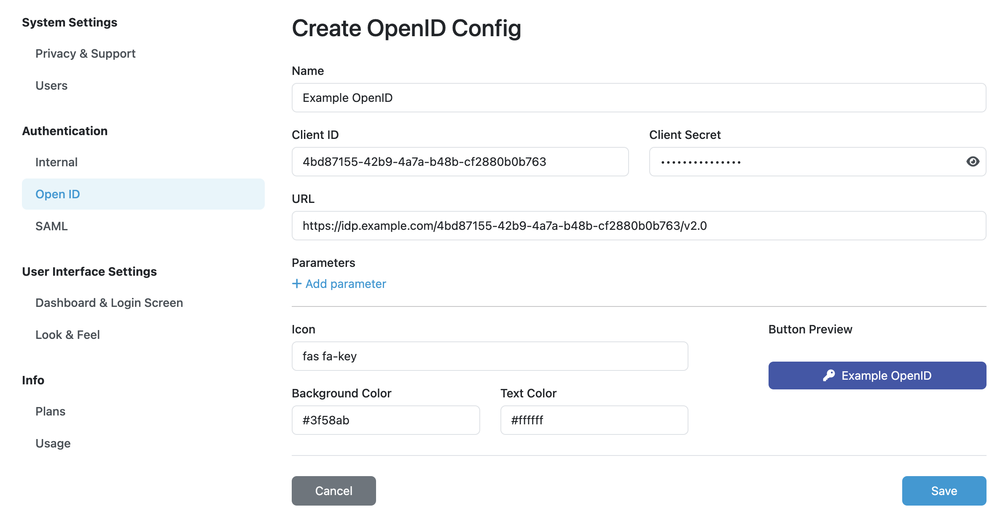

Open ID Settings
****************

Using these settings we can add `Open ID <https://openid.net/>`__ configuration to allow logging into the |project_name| instance via external identity provider. First, press :guilabel:`Create` button and fill **Name** of the service (use only lowercase alphanumeric characters or dash symbols). Then, we should prepare the client application on the side of OpenID service:

*  Use **Callback URL** (and optionally **Logout URL**) to create the client
*  Obtain **Client ID** and **Client Secret**
*  Obtain OpenID endpoint **URL** (we may get one ending with ``/.well-known/openid-configuration``, if so we just use the part before this suffix)
*  Configure the client to have the following claims: ``openid``, ``profile``, ``email``
*  Configure the client to provide the following details in ID tokens: ``email``, ``given_name``, ``family_name``

Back in the |project_name| settings, we can fill **Client ID**, **Client Secret**, and **URL** from our OpenID client together with optional **Parameters** (usually not needed). Finally, we can configure how the log-in button will look like by setting **Icon** (by using `Font Awesome <https://fontawesome.com/v6/search?o=r&m=free>`_), **Name**, **Background**, and text/icon **Color**.

.. NOTE::

    After setting a new OpenID service, we should directly test it and verify that the configuration works well. For that, we can simply open our |project_name| instance in a new anonymous window of the web browser.
    

    
    Example configuration of OpenID service.
