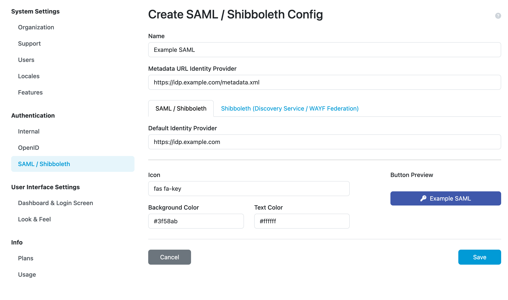
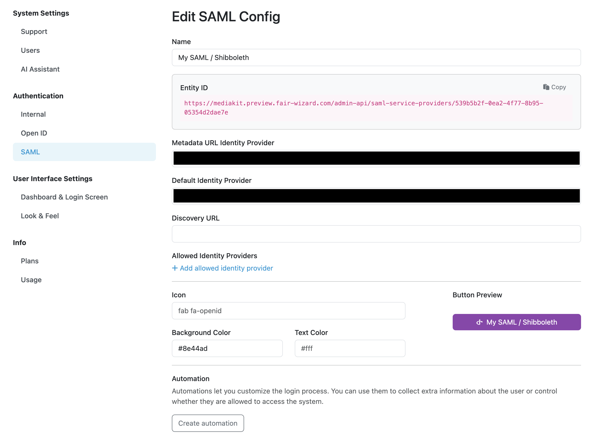

SAML
****

SAML is another option for authentication. However setting up `SAML <https://wiki.oasis-open.org/security/FrontPage>`__ is not trivial and requires certain level of technical knowledge. Please `contact the FAIR Wizard team <mailto:info@fair-wizard.com>`__ team to assist you with SAML configuration.

Based on SAML, FAIR Wizard supports authentication using `Shibboleth <https://www.shibboleth.net/>`__ and `eduGAIN <https://edugain.org/>`__.

.. NOTE::

    For configuration of SAML, Shibboleth or eduGAIN please `contact the FAIR Wizard team <mailto:info@fair-wizard.com>`__.

    
    Example configuration of SAML service.

We can use the **Create automation** button to add some extra steps after users use this login option. There are two tabs. Configuration, where we can set up automation using the `Integration SDK <https://integration-sdk.fair-wizard.com/en/latest/>`__ and Logs where we can see logs of the automation. The automation can have its name changed and it can be enabled or disabled. See details in :ref:`automations`.

    
    Configured SAML service (with hidden details).

.. NOTE::

    There can be only one automation per login configuration however multiple things can be set up in one automation script.
