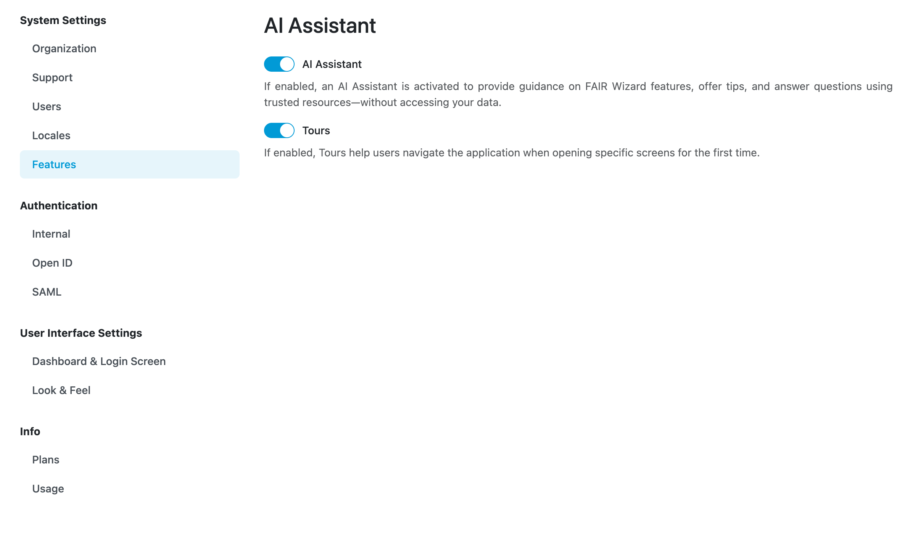
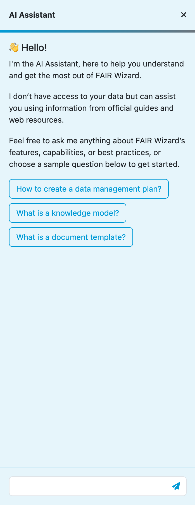

Features
********

Settings of various miscellaneous features.

    Switchable features.

AI Assistant
============

AI Assistant is FAIR Wizard wide feature that allows you to interact with the AI Assistant. The AI Assistant is a chatbot that can help you with various tasks in FAIR Wizard. You can ask the AI Assistant questions about FAIR Wizard, and it will provide you with the information you need. The AI Assistant can also provide knowledge regarding tasks such as creating a new project, creating knowledge models or document templates, and more.

    
    AI Assistant.

The AI Assistant is available in the bottom left corner of the screen. The AI Assistant will appear on the right side, where you can interact with it.

The AI Assistant does not have access to any FAIR Wizard data. Its knowledge is based on the information available in this FAIR Wizard documentation. The AI Assistant is designed to help you navigate FAIR Wizard and provide you with the information you need to complete your tasks.

The AI Assistant can be turned off in the settings.

Tours
=====

Tours provide a way to guide users through the features of FAIR Wizard. Tours are defined on the code level so they are not configurable. However, you can enable or disable them in the settings. If tours are enabled, users can reset tours they have already completed in their user settings.

Tours are not displayed to anonymous users.
