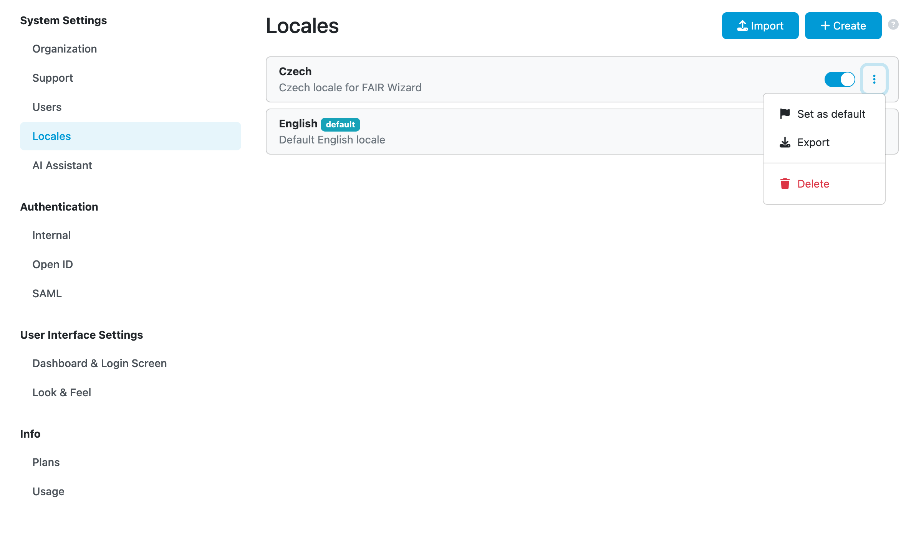

Locales
*******

After navigating to :guilabel:`Locales` (under :guilabel:`System Settings`), we can browse and manage a list of locales in the |project_name|.

There is always the **English** locale (``Default English locale``) which is embedded and cannot be deleted. For others, we can use :guilabel:`Export` and :guilabel:`Delete` options from the right item menu.

Another option is to switch other locale to be the default one using :guilabel:`Set default` action. The default locale will be used if there isn’t an available locale that matches the user’s preferences (explicit or implicit from the web browser) We can :guilabel:`Disable` or :guilabel:`Enable` locales except the default one (which must be enabled).

    
    List of all locales.

----

.. raw:: html
    
    <h2>Table of Contents</h2>

.. toctree::
    :maxdepth: 2

    Import<locales/import>
    Create<locales/create>
