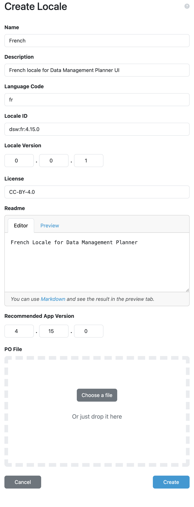

Create Locale
*************

We can create a new locale directly in |project_name| by pressing :guilabel:`Create` from :doc:`../locales`. We need to fill the details about the new locale such as name, description, language code (`RFC5646 <https://www.rfc-editor.org/rfc/rfc5646.html>`__, e.g. ``en`` or ``en-GB``), locale ID, locale version, license, README (with Markdown syntax), and recommended app version. The recommended app version captures for which version of the |project_name| is this locale intended and compatible with (it can be used in other versions as well but may have some untranslated texts).

Finally, a PO files are requested from us. We can create such PO file in a standard (`gettext <https://www.gnu.org/software/gettext/>`__-based) way. There is a PO file for each app of FAIR Wizard and also for the emails.

For creating your own locale, `please contact the FAIR Wizard team <mailto:support@fair-wizard.com>`__. We can also use the :doc:`./import` option to import an existing locale.

    
    Detail of a locale.

.. TODO::

    Update, that the localization is different and only for the Data Management Planner.

