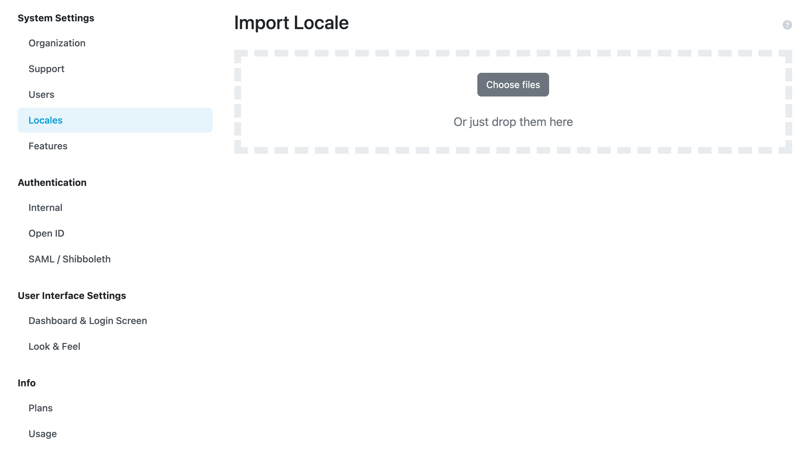

.. _locale-import:

Import Locale
*************

We can import an existing locale by navigating to :menuselection:`Administration → Locales` in the main menu and then clicking on :guilabel:`Import` button on the list of locales.

We can import a locale as a ZIP package. Such a package can be created as an export from FAIR Wizard. We can also select multiple files at once.

    Input for importing a locale using a ZIP package (exported from some other FAIR Wizard instance).
