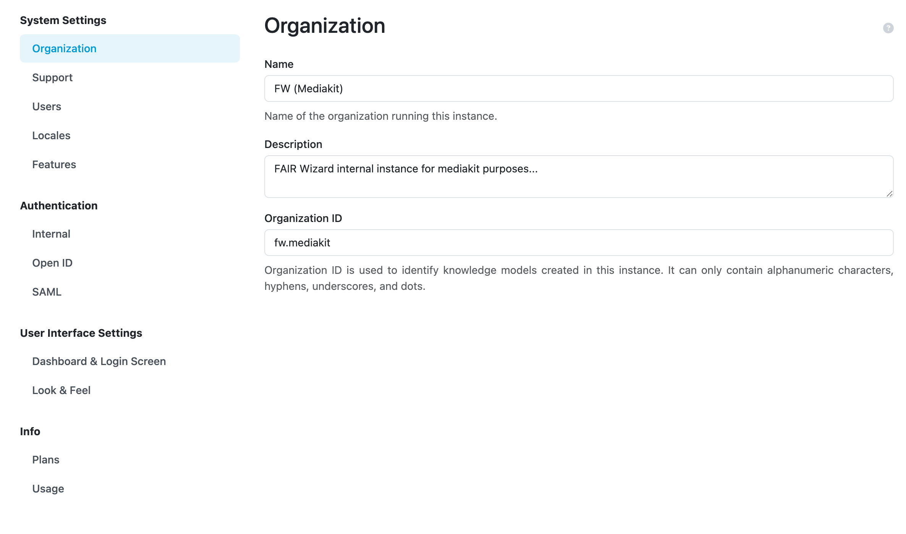

.. _organization-settings:

Organization
************

On this page, we can configure **Name**, **Description**, **Organization ID** for our FAIR Wizard.

The organization ID is used as a part of knowledge models and document templates IDs.

    Organization settings.

.. NOTE::

    It is recommended to use period as for domain name or to use it for capturing organizational structure in the ID, for example, ``faculty.university`` or ``group.faculty.university``.

