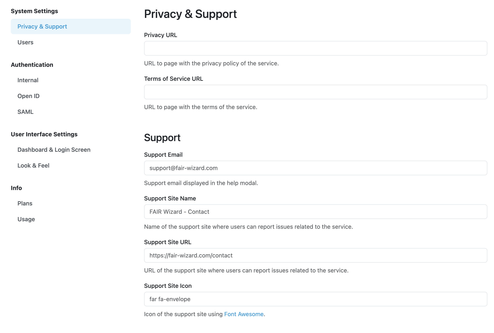

Privacy & Support Settings
**************************

To request users to agree with **Privacy Policy** and/or **Terms of Service** documents, we can configure URLs to locate such documents. Then, when new users register to the service or login for the first time, they will be prompted to agree with the linked documents. Note that usually you should inform already registered users in case you change such documents.

Support
=======

These settings also allow us to configure **Support Email** that users can use to request help or report issues. Similarly **Support Site Name** and **Support Site URL** can be used in case we want users to create tickets in issue tracker of some repository, e.g., on GitHub. **Support Site Icon** can also be configured, using `Font Awesome <https://fontawesome.com/v6/search?o=r&m=free>`_. These support links together with an icon are then shown in :guilabel:`Report issue` modal window.

    
    Privacy and Support settings.
