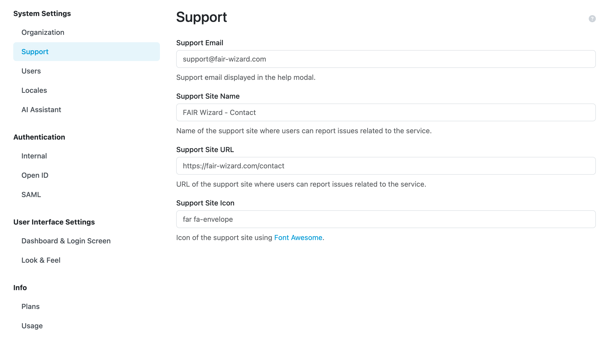

Support
*******

These settings also allow us to configure **Support Email** that users can use to request help or report issues. Similarly **Support Site Name** and **Support Site URL** can be used in case we want users to create tickets in issue tracker of some repository, e.g., on GitHub. **Support Site Icon** can also be configured, using `Font Awesome <https://fontawesome.com/v6/search?o=r&m=free>`_. These support links together with an icon are then shown in :guilabel:`Report issue` modal window.

.. NOTE::

    Terms of Service and Privacy Policy can no longer be customized. If you require custom Terms of Service or Privacy Policy, please contact the `FAIR Wizard support <mailto:support@fair-wizard.com>`_.

    Support settings.
