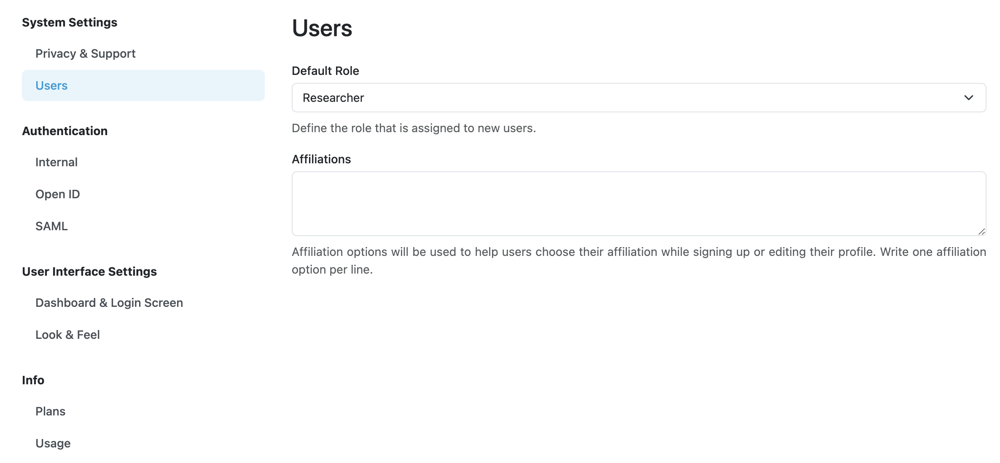

Users Settings
**************

Users Settings allow us to configure default role for new users. It is also possible to set up a list of affiliations that will be suggested to users while they register or update their profiles.

.. WARNING::

    It is recommended to set up the default role for new users with lowest possible rights, **Researcher**. This way, users will not have access to change any settings.

Another part of settings on this page are **Affiliations**. It servers to pre-define a list of possible affiliations (on per line) that will be suggested to users while they register or update their profiles.

    
    Users settings.
