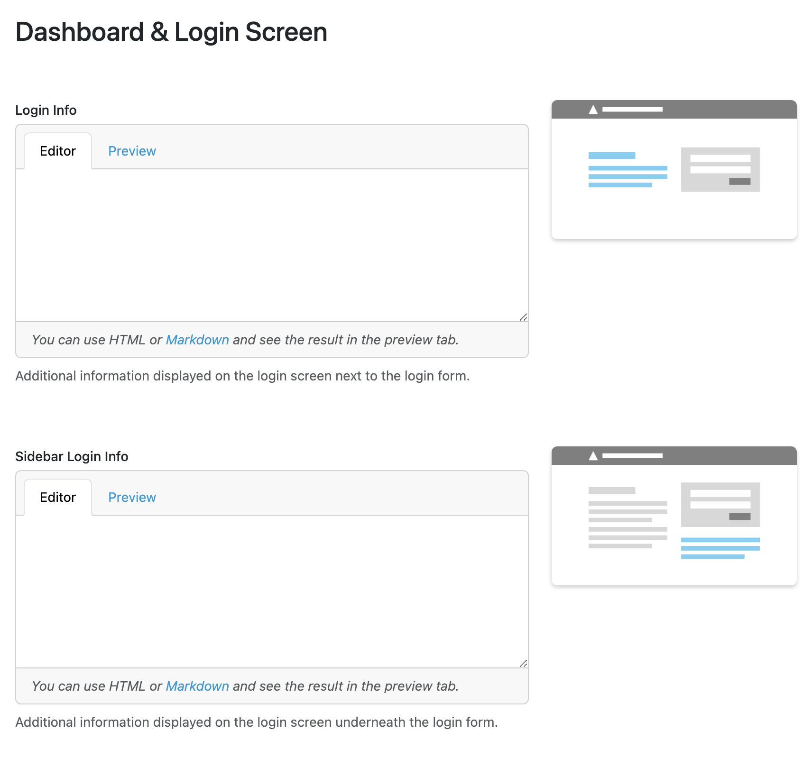

Dashboard and Login Screen Settings
***********************************

.. _login-info:

Login Info
==========

It is possible to write a message that users will see before logging in the |project_name|, using HTML or Markdown. The Login info is placed in the center of the login screen. We can use it to explain users in what cases they can/should use our |project_name|, how they should log in (e.g. if we have more :ref:`authentication services<auth-services>` configured), or if there is any news regarding our |project_name|.

.. WARNING::

  Defining HTML classes in the login info can overwrite |project_name| application classes. It is recommended to use prefixes for classes, if they are used, to avoid conflicts.

.. _sidebar-login-info:

Sidebar Login Info
==================

It is also possible to write another message that users will see on the login screen. The Sidebar Login info is placed underneath the login form. We can also use HTML or Markdown as in the Login Info.

.. WARNING::

  Defining HTML classes in the login info can overwrite |project_name| application classes. It is recommended to use prefixes for classes, if they are used, to avoid conflicts.

    
  Privacy and Support settings.

Announcements
=============

Another option to adjust the dashboard and/or the login screen is to add Announcements. Announcements are displayed above the main content in the login screen. In dashboard, they are also displayed above the main content for both **welcome** and **role-based** dashboard style. There are three levels of Announcements:

* **Info** - light blue color for sending information to the users.
* **Warning** - yellow to warn the users about something.
* **Critical** - red to signalize the Announcement is critical and it needs attention.

The content of the Announcement can be edited using Markdown. There are also two additional switches which determine, where the Announcement is displayed. The Announcement can be set up to be displayed either on the dashboard after users log in or on the login screen before the users log in. It is also possible to display the same Announcement in both places. Number of Announcements is not limited.

    
  Announcements settings.
