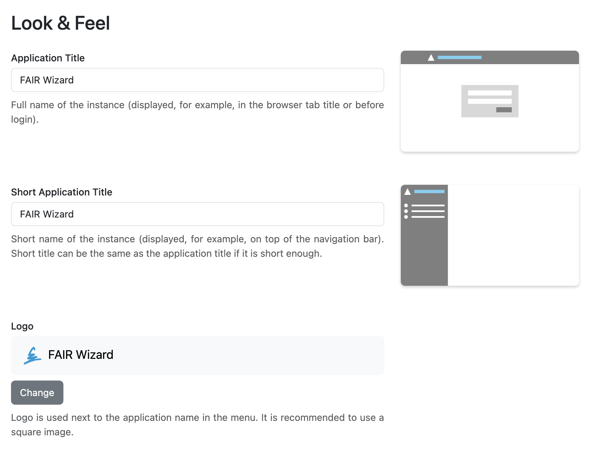
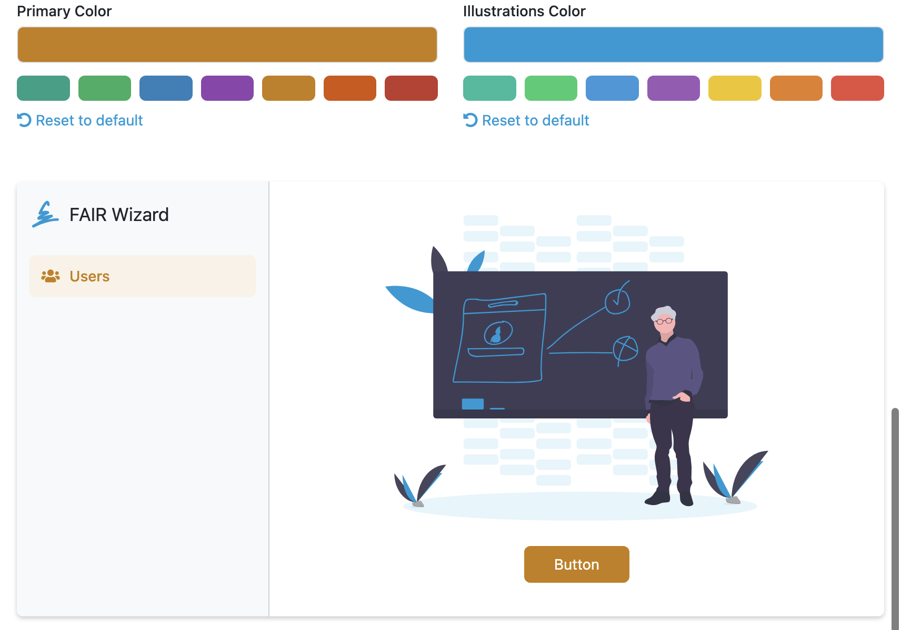
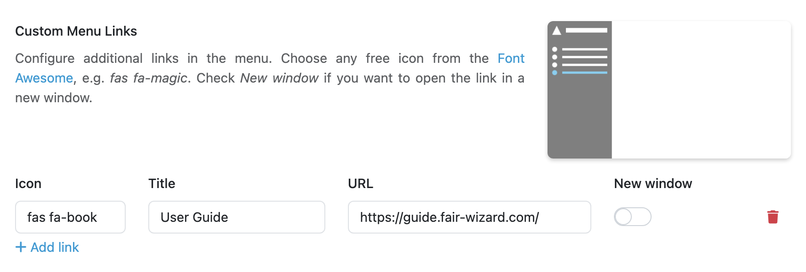

Look and Feel Settings
**********************

Look and Feel Settings allow us to configure **Application Title** and **Short Application Title**. They are used together with **Logo** in the |project_name| and also in various email templates (invitation to a project, forgotten password, ...).

    Titles and logo settings.
    

**Primary Color** and **Illustrations Color** can be used to customize the look of the |project_name|, for example by using company colors.

    Colors settings.

Lastly we can easily add custom links to the main (left) menu by clicking :guilabel:`Add link` under **Custom Menu Links**. For each link, we can set **Icon** (from `Font Awesome <https://fontawesome.com/v5/search>`_), **Title** and the target **URL**. We can also set whether the link should open in **New Window** (if not, it will navigate user directly in the same window/tab from |project_name|). Once the links are there, we can manage them or delete them at this place.

.. TODO::

    Fix screenshot, watch out for DSW, add screenshot, it can be the same as for Planner settings.

    
    Example configuration of a custom menu link.
    