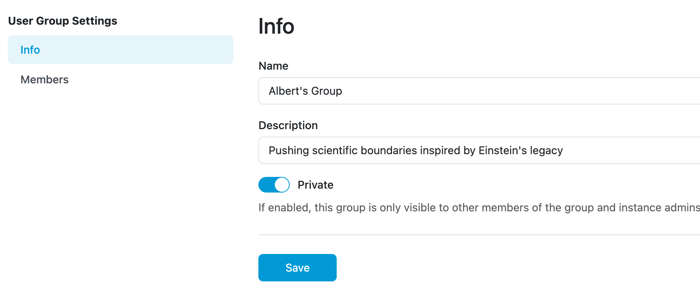
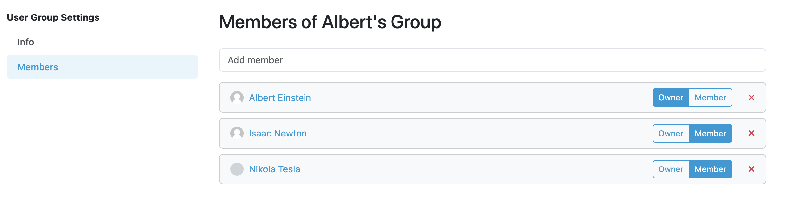

.. _detail:

User Group Detail
*****************

As an admin, we can manage existing user group from User Group Settings. We can change name and description of a group and make it **private**. If a group is private, then only its members and application admins can see it.

    User group detail.

We can also see list of all members of a group. Each member can be set as either owner of a group or its member. Owner of the group can change the visibility and add or remove its members. The member can only view the user groups he is part of if they are private and view all public user groups. We can view group members’ profile by clicking his name.

    User group members.

We can add new members to the group by picking them from dropdown menu.

.. NOTE::

    Don't forget to click on the Save button to save the changes.
