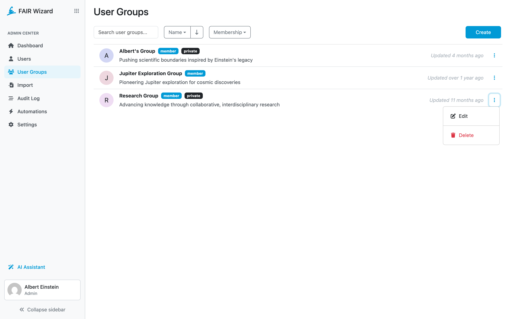

.. _user-groups:

User Groups
***********

Signed-in users can create a user group. The group can be used to add multiple people to a project at once. A group can be selected in :ref:`sharing settings<sharing>` of a project.

The User Groups list allows us to see and manage user groups in the FAIR Wizard. The list can be searched by name fragment and sorted by user group properties, name, and date created. Membership of a user group is indicated by a blue :guilabel:`member` badge.

User Group Settings can be opened by clicking the name of a user group or by selecting :guilabel:`Edit` in the right dropdown menu for the desired row. There, a user group can also be deleted via the :guilabel:`Delete` action. Finally, a new user group can be created by clicking :guilabel:`Create`.

    User groups.

----

.. raw:: html

    <h2>Table of Contents</h2>

.. toctree::
    :maxdepth: 2

    Create<create>
    Detail<detail>
