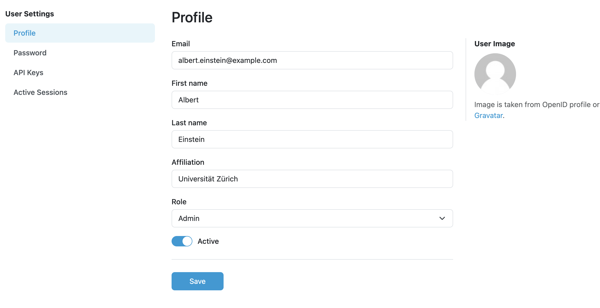
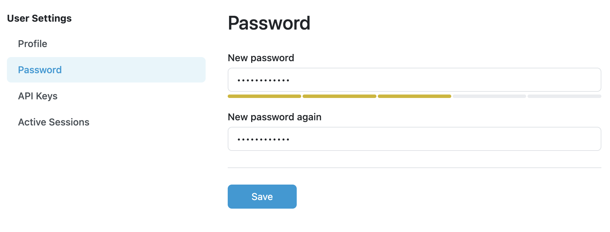

.. _user-detail:

User Detail
***********

As administrators, we can edit existing users manually on the detail (selected user from the :ref:`users list<user-list>`). It is possible to change all properties of the user, including possibility to change whether the user account is active or inactive. 

    
    Detail of a user profile.

The password can be also changed (after selecting :guilabel:`Password` from the left navigation of user settings).

    
    Form for changing password of a user.

.. _user-roles:

User Roles
==========

There are three user roles available: researchers, data steward, and admin. Permissions are associated with the roles, basically they affect what the users can do in the FAIR Wizard:

.. raw:: html

    

        <table class="docutils align-default">
            <thead>
                <tr>
                    <th></th>
                    <th>Researcher</th>
                    <th>Data Steward</th>
                    <th>Admin</th>
                </tr>
            </thead>
            <tbody>
                <tr>
                    <td>Projects</td>
                    <td class="text-center">✔</td>
                    <td class="text-center">✔</td>
                    <td class="text-center">✔ (all)</td>
                </tr>
                <tr>
                    <td>Knowledge Models</td>
                    <td class="text-center">✔ (read-only)</td>
                    <td class="text-center">✔</td>
                    <td class="text-center">✔</td>
                </tr>
                <tr>
                    <td>Knowledge Models Editors</td>
                    <td class="text-center"></td>
                    <td class="text-center">✔</td>
                    <td class="text-center">✔</td>
                </tr>
                <tr>
                    <td>Document Templates</td>
                    <td class="text-center"></td>
                    <td class="text-center">✔</td>
                    <td class="text-center">✔</td>
                </tr>
                <tr>
                    <td>Integration Hub</td>
                    <td class="text-center"></td>
                    <td class="text-center">✔</td>
                    <td class="text-center">✔</td>
                </tr>
                <tr>
                    <td>User Groups</td>
                    <td class="text-center"></td>
                    <td class="text-center">✔</td>
                    <td class="text-center">✔</td>
                </tr>
                <tr>
                    <td>Settings</td>
                    <td class="text-center"></td>
                    <td class="text-center"></td>
                    <td class="text-center">✔</td>
                </tr>
                <tr>
                    <td>Imports</td>
                    <td class="text-center"></td>
                    <td class="text-center"></td>
                    <td class="text-center">✔</td>
                </tr>
                <tr>
                    <td>Locales</td>
                    <td class="text-center"></td>
                    <td class="text-center"></td>
                    <td class="text-center">✔</td>
                </tr>
                <tr>
                    <td>Users</td>
                    <td class="text-center"></td>
                    <td class="text-center"></td>
                    <td class="text-center">✔</td>
                </tr>
                <tr>
                    <td>Analytics</td>
                    <td class="text-center"></td>
                    <td class="text-center"></td>
                    <td class="text-center">✔</td>
                </tr>
                <tr>
                    <td>Audit Log</td>
                    <td class="text-center"></td>
                    <td class="text-center"></td>
                    <td class="text-center">✔</td>
                </tr>
            </tbody>
        </table>
    

