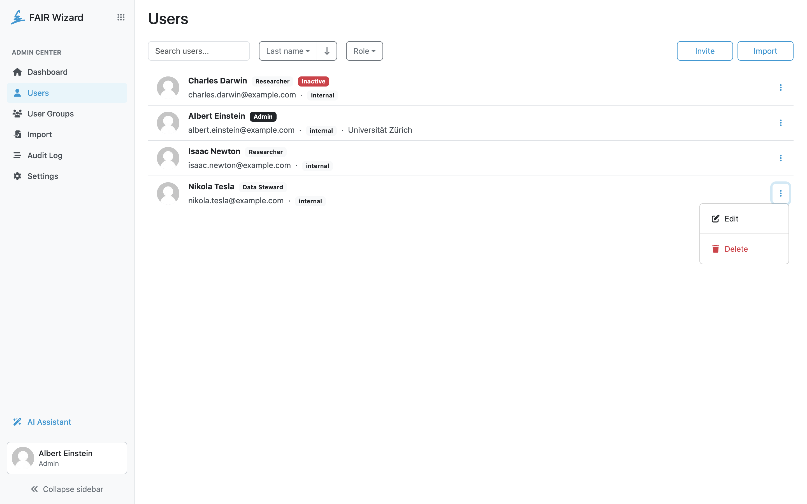

.. _user-list:

Users
*****

Users list allows administrators to see and manage all users in the FAIR Wizard. The list can be filtered using role, searched using name or email fragment, and sorted via various properties of users. The list shows the role of a user next to its name and also indicates in case the user is inactive. Next to the email, we can quickly see what authentication services the user uses to log-in (:guilabel:`internal` is the internal authentication with email-password credentials, other are based on configured :ref:`OpenID services<auth-services>`).

A :ref:`user detail<user-detail>` can be opened by clicking the name of a user or by selecting :guilabel:`Edit` in the right dropdown menu for the desired row. There, a user can be also deleted via the :guilabel:`Delete` action. Finally, administrator can :ref:`invite a new user<user-invite>` by clicking :guilabel:`Invite`, or :ref:`import users<import-users>` by clicking :guilabel:`Import`.

    
    List of users.

----

.. raw:: html
    
    <h2>Table of Contents</h2>

.. toctree::
    :maxdepth: 2

    Invite<invite>
    Detail<detail>
