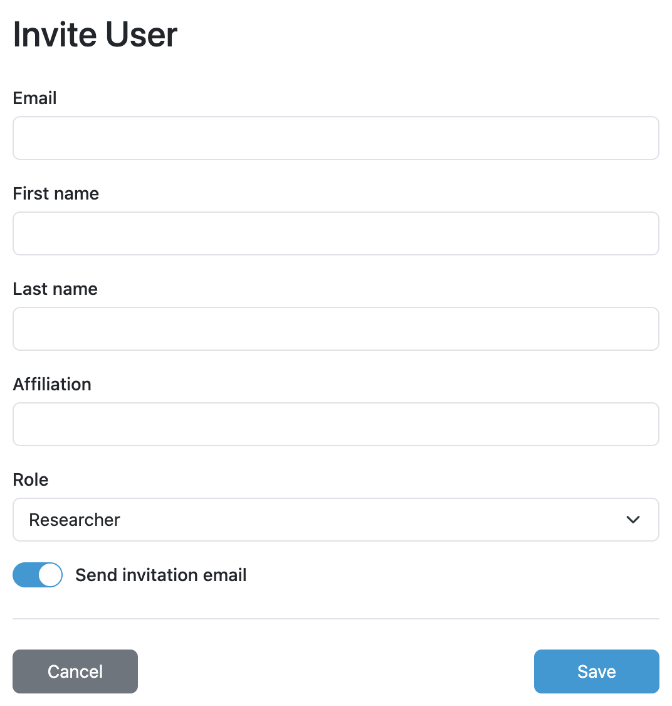

.. _user-invite:

Invite User
***********

As administrators, we can create new users manually by clicking :guilabel:`Invite` on the :ref:`users list<user-list>` and submitting the form. Each user must have a unique email address, first name and last name and assigned :ref:`role<user-roles>`. Optionally, a user can have affiliation specified.

    
    Invite user.    

.. NOTE::

    If the user is invited by administrator, the user is activated by default. We can select if we want to send an invitation email or not by :guilabel:`Send invitation email` switch.
