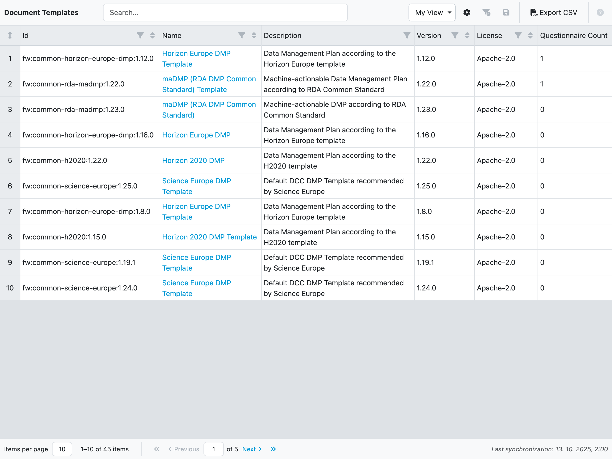
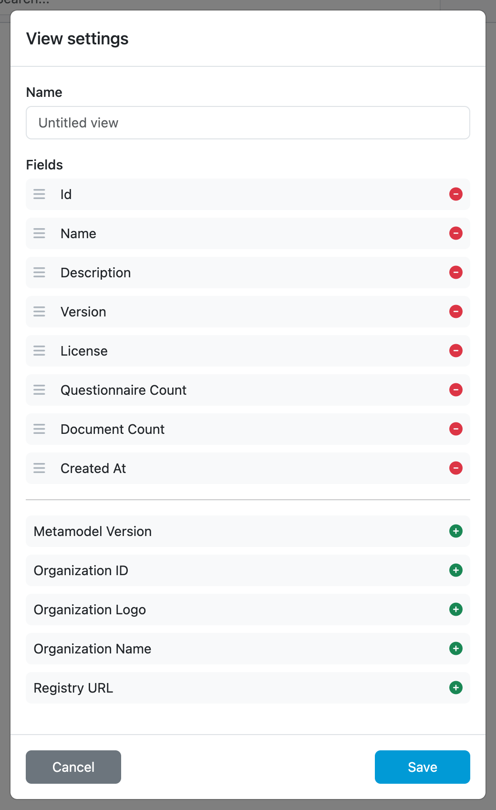
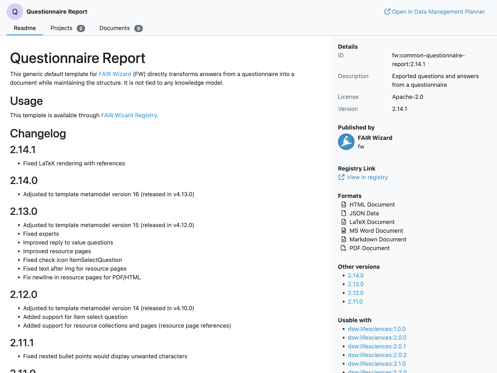

.. _analytics-document-templates:

Document Templates
******************

As an admin, we can view analytics of document templates. We can create and edit views by selecting from many different fields and see how our document templates are doing. The view can be modified and save to be reviewed later. The data can also be exported to a CSV file.

    
    Document Templates overview.

New view can be created by clicking on the dropdown menu in the top right corner. Then by clicking on :guilabel:`+ Create a new view` we open the view settings. We can give our view a name and select which fields we want to have in there. The view can be saved by clicking on :guilabel:`Save`. We can also delete the view by clicking on :guilabel:`Delete`.

    
    Form for editing analytics view.

Various fields have filters that can be used to narrow down the data.

We can also resize all rows height by clicking on the double arrow in the top left corner. If we want to edit width or height of individual cells, we can do it using drag-and-drop on the borders. Lastly we can edit how many rows are on the page by clicking on the :guilabel:`Items per page` dropdown menu.

.. NOTE::

    Don't forget to click on :guilabel:`Save` icon after you are done with editing the view.

The data of a view can be exported to a CSV file by clicking on :guilabel:`Export CSV`.

Document templates details
--------------------------

By clicking on the document template name, we can open that document template detail. The document template detail has three tabs and details. The tabs are as follows:

- Readme
- Projects
- Documents

The :guilabel:`Readme` tab shows readme file of the selected document template. The :guilabel:`Projects` tab shows all projects created using selected document template. The :guilabel:`Documents` tab shows all Documents that were generated using the selected document template, across all projects.

The document template details on the right side show additional document template metadata, such as ID, description, version, publisher, formats and knowledge models it can be used with.

Lastly we can click on the :guilabel:`Open in Data Management Planner` button to open the actual document template.

    Detail of a document template.

