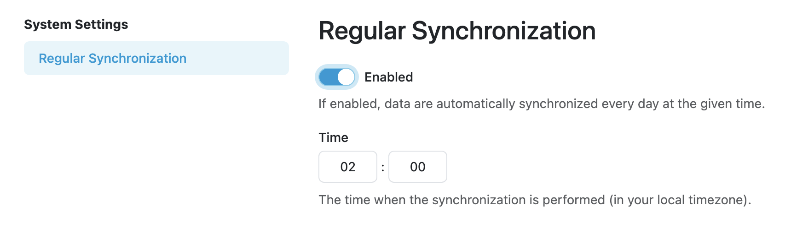

.. _analytics:

Analytics
*********

Analytics is an application that gathers data from other applications and is used to view that data in comfortable and customizable way. Data is gathered from :ref:`projects<projects>`, :ref:`users<user-list>` and :ref:`user groups<user-groups>`.

To get latest data, click on :guilabel:`Synchronize Data` button. This will synchronize the data from the other apps and store it in the analytics database. Once the data has been updated, the page will automatically refresh.

It is also possible to turn on regular synchronization in settings. This will synchronize the data every day at set time.

    Regular Synchronization settings.

.. NOTE::

    Don't forget to click on :guilabel:`Save` to activate regular synchronization.

----

.. raw:: html
    
    <h2>Table of Contents</h2>

.. toctree::
    :maxdepth: 2

    Knowledge Models<knowledge-models>
    Projects<projects>
    Users<users>
    User Groups<user-groups>
    