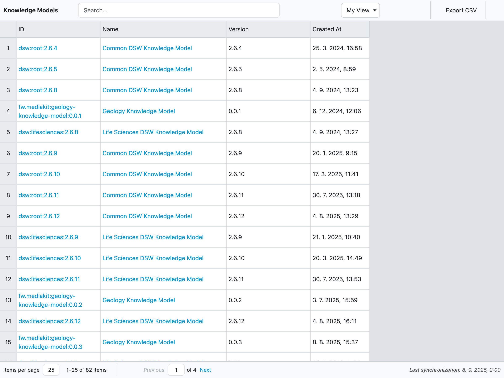
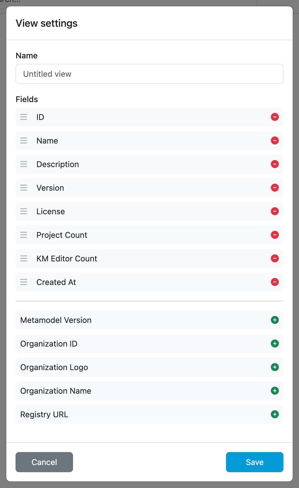
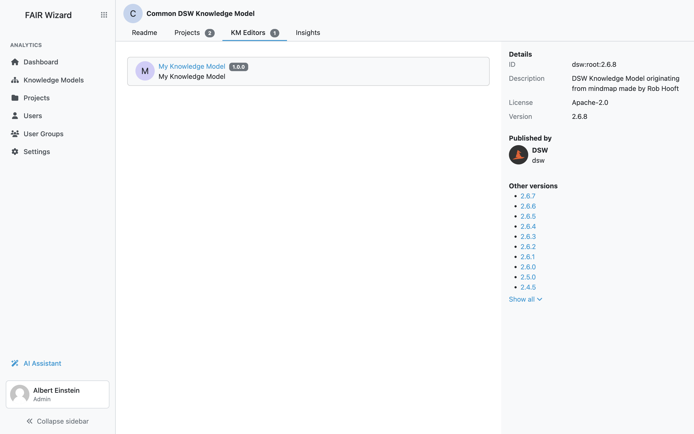
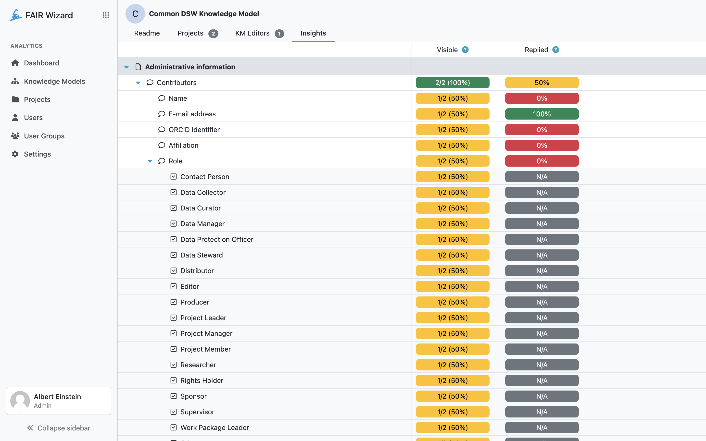

.. _analytics-knowledge-models:

Knowledge Models
****************

Users with the :ref:`Use Analytics<roles>` role permission can view analytics of knowledge models. We can create and edit views by selecting from many different fields and see how our projects are doing. The view can be modified and save to be reviewed later. The data can also be exported to a CSV file.

    Knowledge models overview.

New view can be created by clicking on the dropdown menu in the top right corner. Then by clicking on :guilabel:`+ Create a new view` we open the view settings. We can give our view a name and select which fields we want to have in there. The view can be saved by clicking on :guilabel:`Save`. We can also delete the view by clicking on :guilabel:`Delete`.

    Form for editing analytics view.

Various fields have filters that can be used to narrow down the data.

We can also resize all rows height by clicking on the double arrow in the top left corner. If we want to edit width or height of individual cells, we can do it using drag-and-drop on the borders. Lastly we can edit how many rows are on the page by clicking on the :guilabel:`Items per page` dropdown menu.

The data of a view can be exported to a CSV file by clicking on :guilabel:`Export CSV`.

.. NOTE::

    Don't forget to click on :guilabel:`Save` icon after you are done with editing the view.

Knowledge model details
-----------------------

By clicking on the knowledge model ID or name, wew can open that knowledge model detail. If we choose to click on a certain version of a knowledge model, that specific versions detail will open. The knowledge model detail has four tabs and details. The tabs are as follows:

- Readme
- Projects
- KM Editors
- Insights

The :guilabel:`Readme` tab shows the exact information that we can see in the knowledge model detail within the Data Management Planner. The :guilabel:`Projects` tab shows all projects that are using the selected knowledge model. The :guilabel:`KM editors` tab shows all knowledge model editors that are using the selected knowledge model. Both of these tabs also display numbers next to them, representing the number of created projects or knowledge model editors.

    Knowledge model editors created using this knowledge model.

The last tab, :guilabel:`Insights`, is the most complex. It shows us detailed information for each question and answer, such as the number of times a certain question was displayed to users and how these questions were answered. If we are viewing details of a value question, we can use search functionality to find the value we are interested in.

Furthermore, we can also open various questions to see insights into how the Researchers are answering them.

The knowledge model details on the right side show additional knowledge model metadata, such as ID, description, license and version.

Lastly we can click on the :guilabel:`Open in Data Management Planner` button to open the actual knowledge model.

    Insights to usage of this knowledge model in projects.
