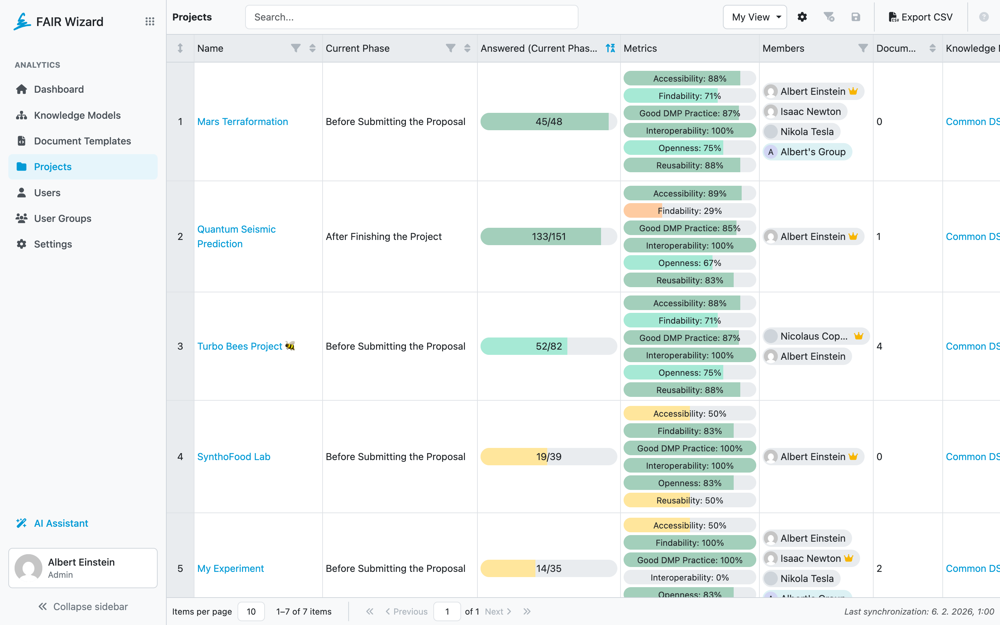
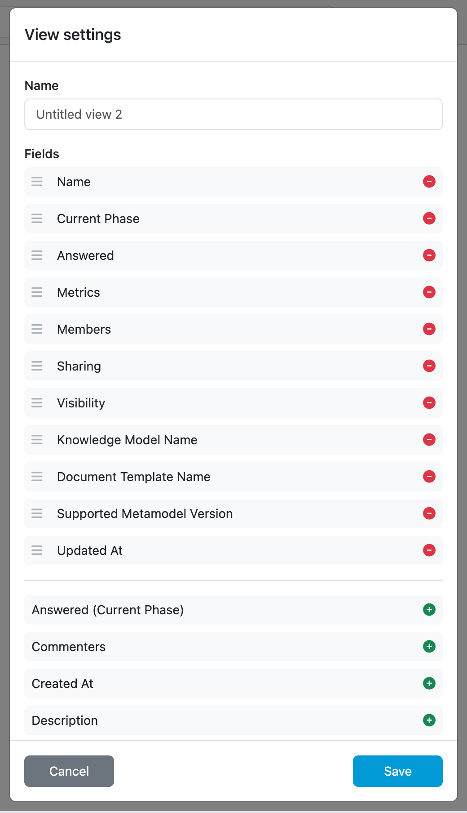
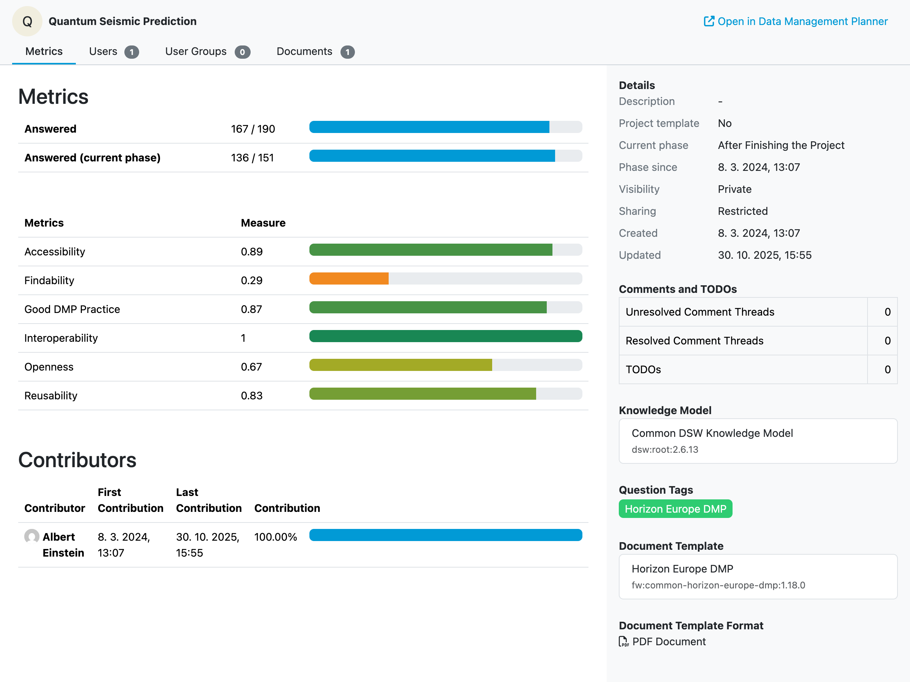

.. _analytics-projects:

Projects
********

As an admin, we can view analytics of projects. We can create and edit views by selecting from many different fields and see how our projects are doing. The view can be modified and save to be reviewed later. The data can also be exported to a CSV file.

    Projects overview.

New view can be created by clicking on the dropdown menu in the top right corner. Then by clicking on :guilabel:`+ Create a new view` we open the view settings. We can give our view a name and select which fields we want to have in there. The view can be saved by clicking on :guilabel:`Save`. We can also delete the view by clicking on :guilabel:`Delete`.

    Form for editing analytics view.

Various fields have filters that can be used to narrow down the data.

We can also resize all rows height by clicking on the double arrow in the top left corner. If we want to edit width or height of individual cells, we can do it using drag-and-drop on the borders. Lastly we can edit how many rows are on the page by clicking on the :guilabel:`Items per page` dropdown menu.

.. NOTE::

    Don't forget to click on :guilabel:`Save` icon after you are done with editing the view.

The data of a view can be exported to a CSV file by clicking on :guilabel:`Export CSV`.

Project details
---------------

By clicking on the project name, we can open that project detail. The project detail has four tabs and details. The tabs are as follows:

- Metrics
- Users
- User Groups
- Documents

The :guilabel:`Metrics` tab shows all metrics that are used in the selected project. We can also see contributors, who is contributing to the project, when and what is the share of contributions. The :guilabel:`Users` tab shows all users that are part of the selected project and their roles. The :guilabel:`User Groups` tab shows all user groups that are part of the selected project and their role. The :guilabel:`Documents` tab shows all documents that were generated using the project. There are also other document metadata, such as format, size, and author.

The project details on the right side show additional project metadata, such as description, phase, sharing options, numbers of comments and TODOs, project tags, knowledge model and questions tags.

Lastly we can click on the :guilabel:`Open in Data Management Planner` button to open the actual project.

    Projects detail.

