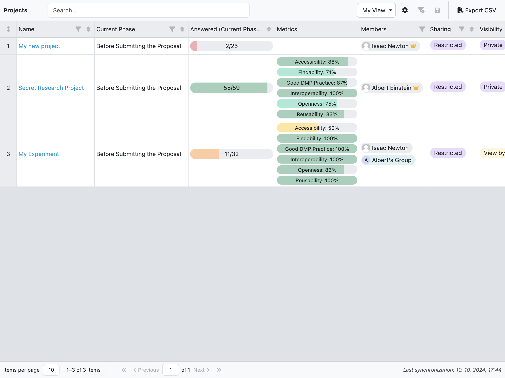
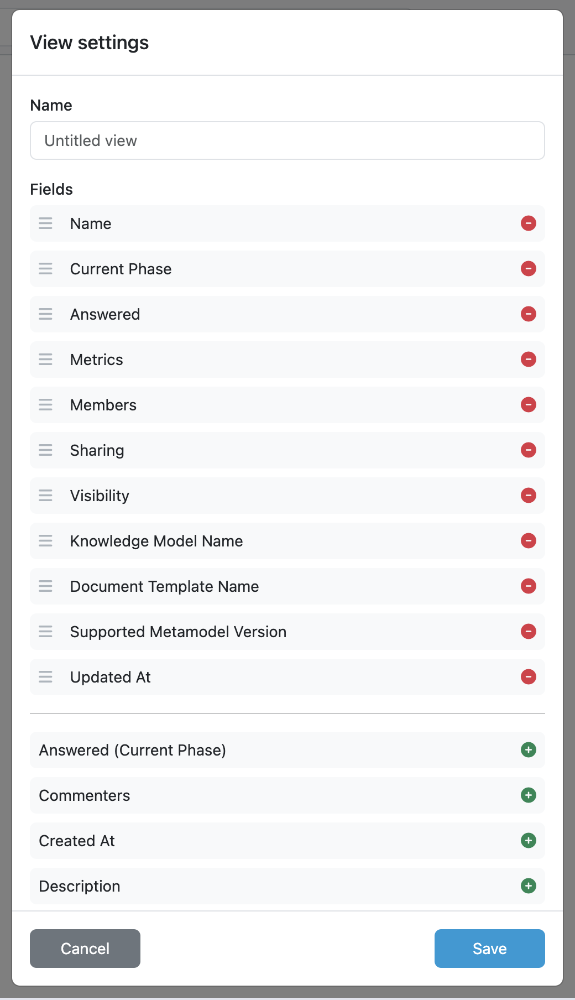

.. _analytics-projects:

Projects
********

As an administrator, we can view analytics of projects. We can create and edit views by selecting from many different fields and see how our projects are doing. The view can be modified and save to be reviewed later. The data can also be exported to a CSV file.

    
    Projects overview.

New view can be created by clicking on the dropdown menu in the top right corner. Then by clicking on :guilabel:`+ Create a new view` we open the view settings. We can give our view a name and select which fields we want to have in there. The view can be saved by clicking on :guilabel:`Save`. We can also delete the view by clicking on :guilabel:`Delete`.

    
    Form for editing analytics view.

Various fields have filters that can be used to narrow down the data.

.. TODO::

    Add screenshot for filters.

We can also resize all rows height by clicking on the double arrow in the top left corner. If we want to edit width or height of individual cells, we can do it using drag-and-drop on the borders. Lastly we can edit how many rows are on the page by clicking on the :guilabel:`Items per page` dropdown menu.

.. NOTE::

    Don't forget to click on :guilabel:`Save` icon after you are done with editing the view.

The data of a view can be exported to a CSV file by clicking on :guilabel:`Export CSV`.
