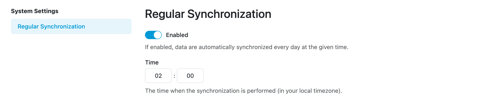

Settings
********

Regular Synchronization
-----------------------

Under system settings we can set up regular synchronization. We can select the time of day when the synchronization will happen. The time is set in your local time zone.

    Regular synchronization settings.

