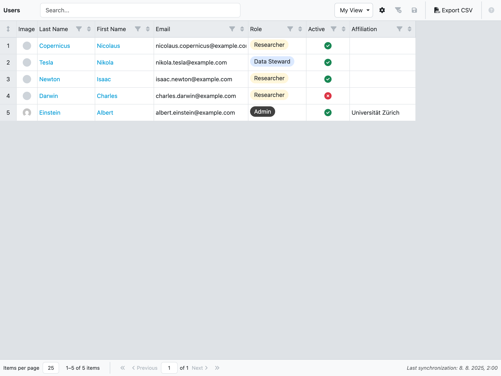
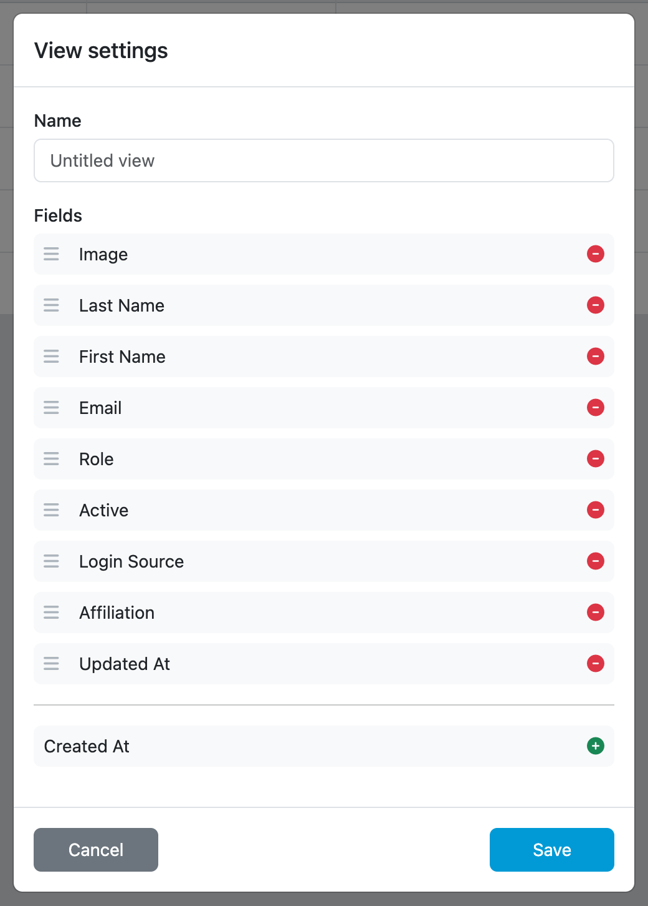
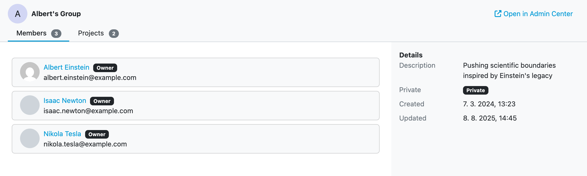

.. _analytics-users:

Users
*****

As an administrator, we can view analytics of Users. We can select from many different fields and see how our Users are doing. The view can be modified and save to be reviewed later. The data can also be exported to a CSV file.

    
    Users overview.

New view can be created by clicking on the dropdown menu in the top right corner. Then by clicking on :guilabel:`+ Create a new view` we open the view settings. We can give our view a name and select which fields we want to have in there. The view can be saved by clicking on :guilabel:`Save`. We can also delete the view by clicking on :guilabel:`Delete`.

    
    Form for editing analytics view.

Various fields have filters that can be used to narrow down the data.
    
We can resize all rows height by clicking on the double arrow in the top left corner. If we want to edit width or height of individual cells, we can do it using drag-and-drop on the borders. Lastly we can edit how many rows are on the page by clicking on the :guilabel:`Items per page` dropdown menu.

The data of a view can be exported to a CSV file by clicking on :guilabel:`Export CSV`.

.. NOTE::

    Don't forget to click on :guilabel:`Save` icon after you are done with editing the view.

User details
------------

By clicking on the first or last name of a User, we can open that User detail. The User detail has two tabs and details. The tabs are as follows:

- Projects
- User Groups

The :guilabel:`Projects` and :guilabel:`User Groups` tabs show the number of respective items. In the :guilabel:`Projects` tab we can the list of Projects which this User is part of and their role in the Project. In the :guilabel:`User Groups` tab we can see list of User Groups this User is member or owner of and the Group visibility.

The User details on the right side shows additional User metadata, such as Role, Email, or Affiliation.

Lastly we can click on the :guilabel:`Open in Admin Center` button to open the actual User.

    
    User detail.

