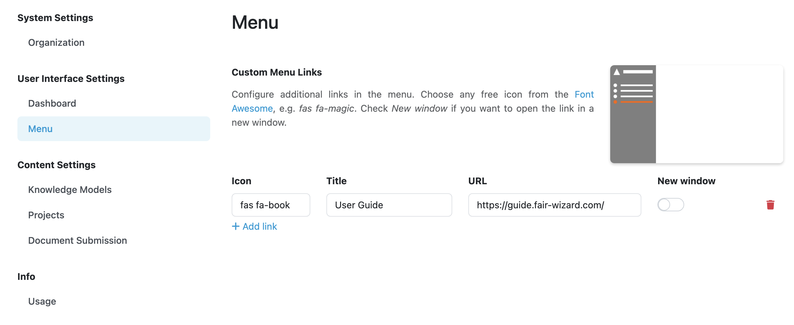

Menu Settings
*************

This part of settings allows us to adjust how the |project_name| menu looks like. 

Custom Menu Links
=================

We can easily add custom links to the main (left) menu by clicking :guilabel:`Add` under **Custom Menu Links**. For each link, we can set **Icon** (from `Font Awesome <https://fontawesome.com/v5/search>`_), **Title** and the target **URL**. We can also set whether the link should open in **New Window** (if not, it will navigate user directly in the same window/tab from |project_name|). Once the links are there, we can manage them or delete them at this place.

    
    Example configuration of a custom menu link.
    