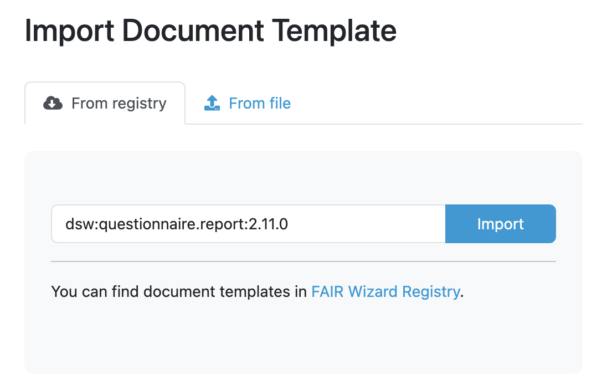
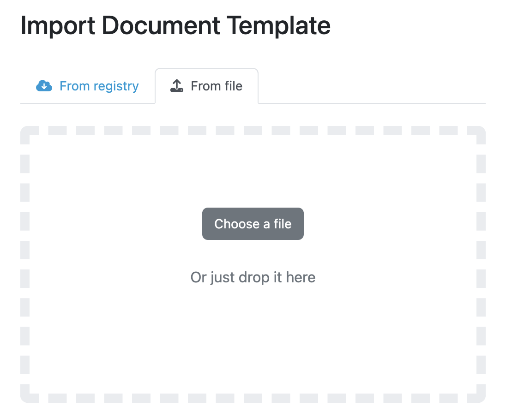

.. _doc-template-import:

Document Template Import
************************

We can import an existing document template by navigating to :doc:`./index` (:menuselection:`Document Templates`) in the main menu and then clicking on :guilabel:`Import` button on the list of document templates.

.. _doc-template-import-from-registry:

From FAIR Wizard Registry
=========================

The |project_name| is connected to the `FAIR Wizard Registry <https://registry.fair-wizard.com/>`__. That allows us to import document templates from it by entering the **document template ID** of desired template (e.g. ``dsw:questionnaire-report:2.11.0``) and pressing the :guilabel:`Import` button.

.. NOTE::

    In case of document templates present in the `FAIR Wizard Registry <https://registry.fair-wizard.com/>`__, we will be notified about the available upgrades.

    
    Input for importing a document template from FAIR Wizard Registry.

From file
=========

We can import a document template as a ZIP package. Such a package can be created as an export from |project_name| or using the Template Development Kit (see :ref:`document-template-development`).

    
    Input for importing a document template using a ZIP package.
