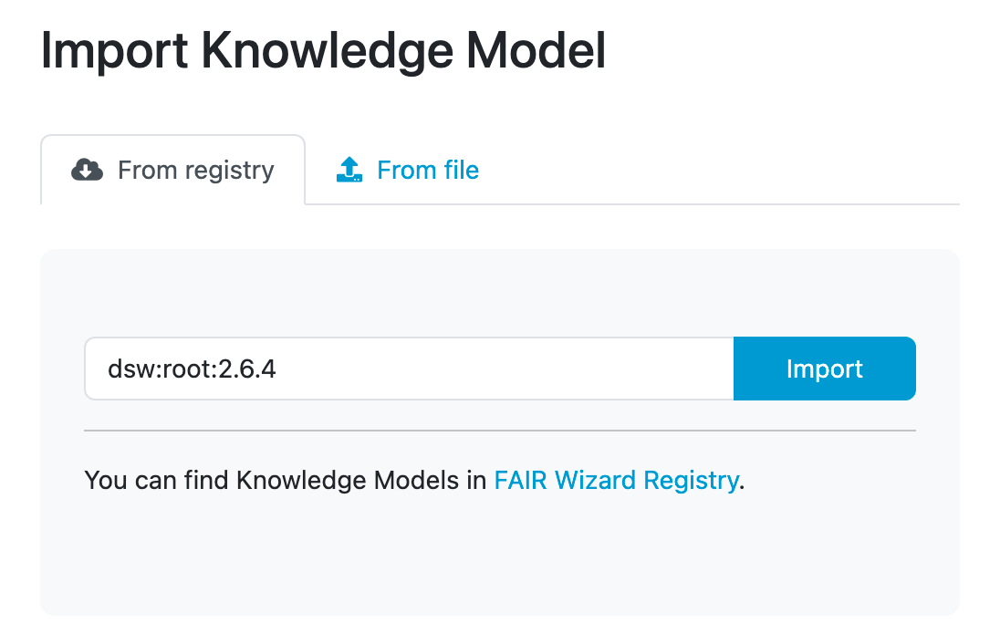
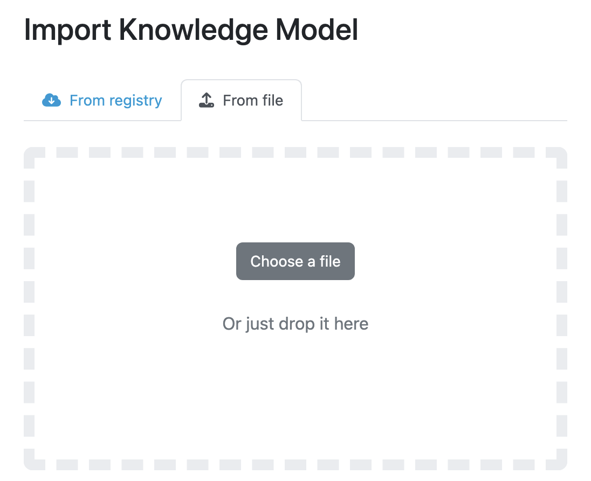

.. _km-import:

Knowledge Model Import
**********************

We can import an existing knowledge model by navigating to :doc:`./index` (:menuselection:`Knowledge Models`) in the main menu and then clicking on :guilabel:`Import` button.

.. _km-import-from-registry:

From FAIR Wizard Registry
=========================

The |project_name| is connected to the `FAIR Wizard Registry <https://registry.fair-wizard.com/>`__. That allows us to import knowledge models from it by entering the **knowledge model ID** of desired template (e.g. ``dsw:lifesciences:2.6.3``) and pressing the :guilabel:`Import` button.

.. NOTE::

    In case of knowledge model present in the `FAIR Wizard Registry <https://registry.fair-wizard.com/>`__, we will be notified about the available upgrades.

    
    Input for importing a knowledge model from FAIR Wizard Registry.

From file
=========

We can import a knowledge model as a KM file. Such a file can be created as an export from |project_name| (from :doc:`./index` or :doc:`./detail`).

    
    Input for importing a knowledge model using a KM package.
