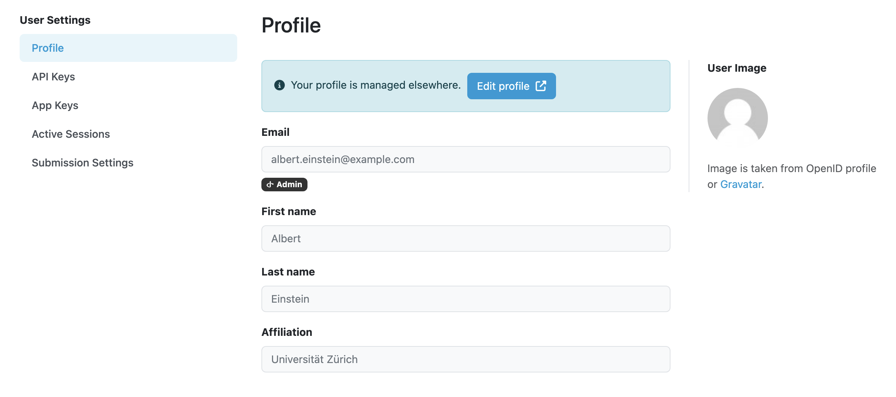

User Settings
*************

After navigating to :guilabel:`Edit profile` from the :doc:`../index` menu, we open the User Settings. We can view our **Email** address, **First name**, **Last name**, and **Affiliation**. To edit those values, we must first switch to the :ref:`Admin App <edit-profile-admin>` and continue there.

We can see API Keys we have generated and App Keys used to connect to different apps.

We can also see Active Sessions and revoke them if needed.

In case of configured submission services, there might be additional inputs under **Submission Settings** such as API tokens or other information used for the document submission.

    
    Form for editting profile with example submission settings.

.. NOTE::

    The values of **Submission Settings** are treated as potentially sensitive information; thus are stored encrypted.

----

.. raw:: html
    
    <h2>Table of Contents</h2>

.. toctree::
    :maxdepth: 2

    API Keys<api-keys>
    App Keys<app-keys>
    Active Sessions<active-sessions>
    Submission Settings<submission-settings>
    