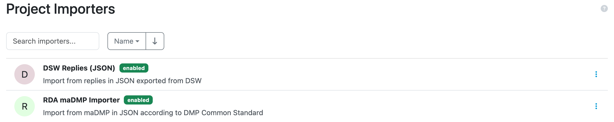

.. _importers:

Importers
*********

.. WARNING::

    Project importers are an experimental feature.

We can use project importers to import data from different |project_name| or even different applications to |project_name|. Each has a set of supported knowledge models defined. This is because each knowledge model has a different structure and the importer needs to understand it so it can import the answers to the correct questions.

.. NOTE::

    Only data stewards or admins can access project importers.

If we navigate to :guilabel:`Projects → Importers`, we can see the list of all available importers. We can enable or disable them by clicking on the triple dots icon and choosing the appropriate action.

    
    List of project importers where we can enable or disable them.

More information about how to develop project importers is available on the :ref:`project importers development<development-importers>` page.

We can use the project importers to import data into project. We can use either the DSW Replies importer or RDA maDMP Importer:

- DSW Replies importer - imports data from Questionnaire Report JSON document. We can create this with any project (created by any knowledge model) using the Questionnaire Report template. The output JSON can be used to import replies to a different project.
- RDA maDMP Importer - imports data from RDA maDMP JSON document. This importer relies in a specific project structure and can be only used with Common DSW Knowledge Model and RDA maDMP template used to create the output file, that is then used by the importer. 
