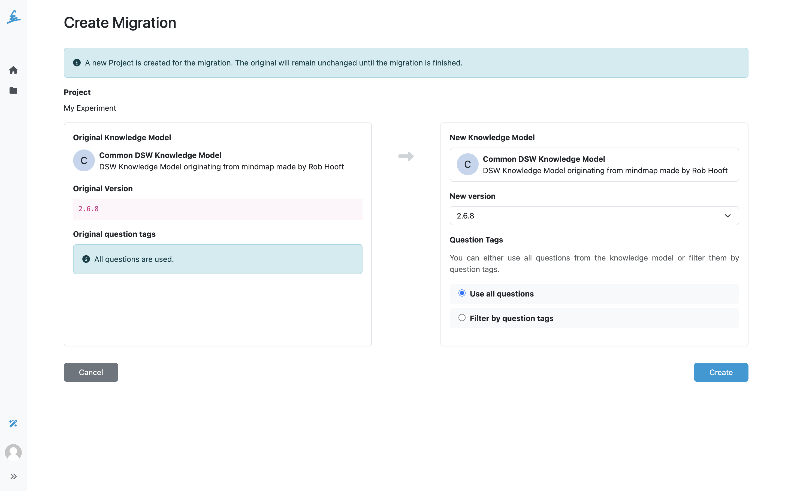

.. _project-migration:

Project Migration
*****************

Every project is based on a specific :ref:`knowledge model<knowledge-model>`, its version, and selected tags. Sometimes, we might want to change the knowledge model to a different version, change the knowledge model, or just change the tag selection. Project migration is a process where we can do this.

Migrating a Project
===================

We can start a project migration either from the :ref:`project list<project-list>` or from the :ref:`project settings<project-settings>`. When a newer version of the knowledge model is available, we can see an :guilabel:`Outdated KM` badge next to the project name in the project list.

    Choosing a new knowledge model for the project.

We can see the **original knowledge model**, its **version**, and selected **question tags** on the left side. On the right side, we can choose new values for all of these. We can use :guilabel:`Compare` to check the changes between the original and selected knowledge model.

After we are satisfied with our selection, we can click :guilabel:`Migrate`. This updates the project to the selected knowledge model version and tag selection.

.. WARNING::

    Replies associated with questions that are not included in the new project may not be carried over. This can happen when questions or answers were removed in the new knowledge model version or when the selected question tags change which questions are included.

After migrating, the default document template or format may need to be selected again in :ref:`project settings<project-settings>` if the previous selection is no longer compatible with the project's knowledge model.
