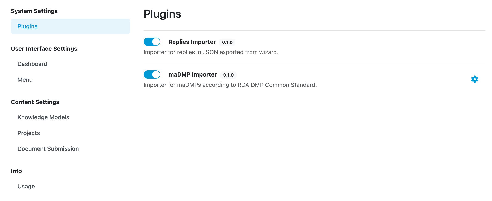

Plugins
*******

Plugins allows us to toggle and configure plugins. For now, there are two plugins available, which are two importers:

- **Replies Importer:** Importer for replies in JSON exported from Data Management Planner.
- **maDMP Importer:** Importer for maDMPs according to RDA DMP Common Standard.

    
    Plugins configuration.