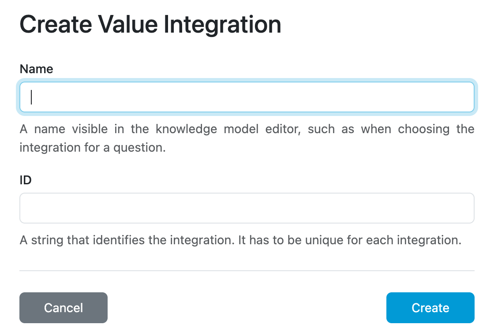

.. _value-integrations-create:

Create
******

Users with the :ref:`Use Integration Hub<roles>` role permission can create a value integration. To start, we must fill in its name and ID. After clicking :guilabel:`Create`, we can continue in the :ref:`value integration detail<detail>`.

    Create value integration.
